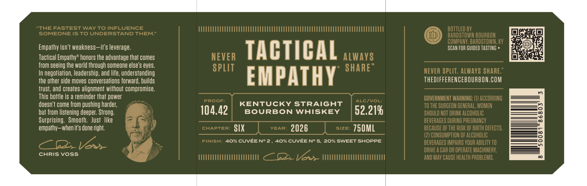

# TTB COLA Label Images - TTBID 26049001000168

**Brand Name:** THE DIFFERENCE

**Issue Date:** 02/19/2026

**Origin Code:** 22

**Product Class/Type:** 101

**Source:** [TTB Public COLA Registry](https://ttbonline.gov/colasonline/viewColaDetails.do?action=publicFormDisplay&ttbid=26049001000168)

## Label Images

### Label 2

### Label 3

## Extracted Label Text

*Text extracted via OCR - may contain errors*

*1 image(s) excluded: text did not meet readability threshold*

### Label 2

Empathy isn't weakness—it's leverage.

Tactical Empathy” honors the advantage that comes
from seeing the world through someone else’s eyes.
In negotiation, leadership, and life, understanding
the other side moves conversations forward, builds
fust, and creates alignment without compromise

This bottle is @ reminder that power
doesn’t come from pushing harder,
but from listening deeper. Strong
Surprising. Smooth. Just like
empathy—when it's done right.

CHRIS Voss.

SCAN FOR GUIDED TASTING »

TACTICAL
EMPATHY

KENTUCKY STRAIGHT

104.42) Bourson wHiskey | 52.21%
six 2026 750ML

40% CUVEE N° 2, 40% CUVEE N° 5, 20% SWEET SHOPPE

THEDIFFERENCEBOURBON.COM
