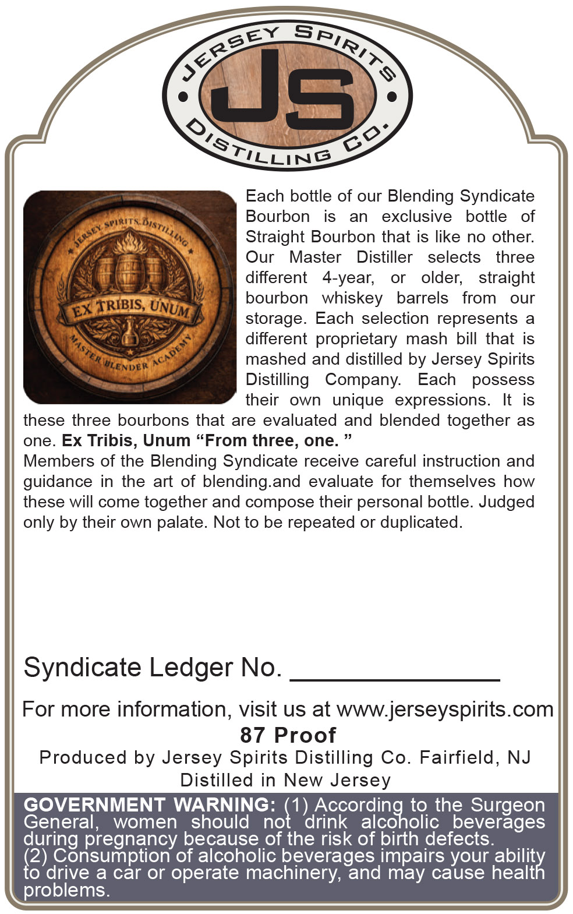
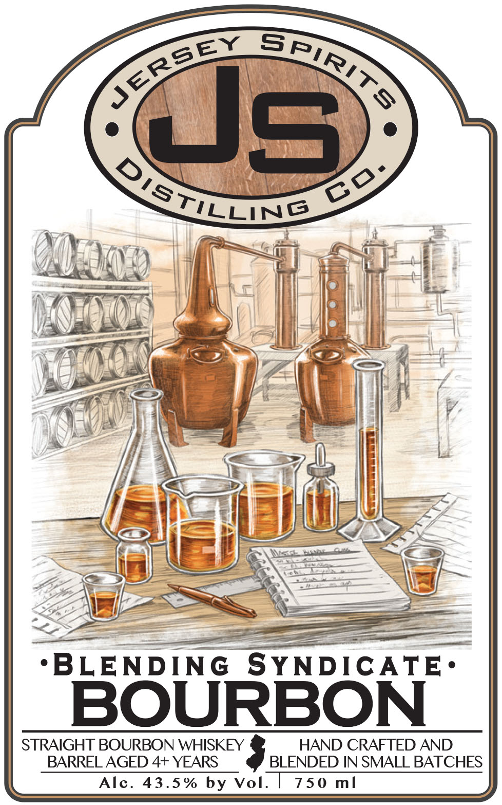

# TTB COLA Label Images - TTBID 26049001000208

**Brand Name:** BLENDING SYNDICATE BOURBON

**Issue Date:** 02/23/2026

**Origin Code:** 03

**Product Class/Type:** 101

**Source:** [TTB Public COLA Registry](https://ttbonline.gov/colasonline/viewColaDetails.do?action=publicFormDisplay&ttbid=26049001000208)

## Label Images

### Back Label

### Front Label

## Extracted Label Text

*Text extracted via OCR - may contain errors*

### Back Label

ev SA,

&,

xe

SL

NG

Each bottle of our Blending Syndicate

Bourbon

is an exclusive bottle of

Oe,

Straight Bourbon that is like no other.

hy

Our Master

Distiller selects three

uw

ie

i

different 4-year,

or older,

straight

bourbon whiskey barrels from our

storage. Each selection represents a

¢

“ay

different proprietary mash bill that is

mashed and distilled by Jersey Spirits

DER

Distilling Company. Each possess

their own unique expressions. It is

these three bourbons that are evaluated and blended together as

one. Ex Tribis, Unum “From three, one. ”

Members of the Blending Syndicate receive careful instruction and

guidance in the art of blending.and evaluate for themselves how

these will come together and compose their personal bottle. Judged

only by their own palate. Not to be repeated or duplicated.

Syndicate Ledger No.

For more information, visit us at www.jerseyspirits.com

87 Proof

Produced by Jersey Spirits Distilling Co. Fairfield, NJ

Distilled in New Jersey

GOVERNMENT WARNING:

1) Accordin

to the Surgeon

General, women should no

drink alcoholic beverages

during pregnancy because of the risk of birth defects.

(2) Consumption of alcoholic beverages impairs your abil

to drive a car or operate machinery, and may cause hea

th

problems.

### Front Label

CSF

ey SRZON

ese

See

NG

|

ii

i

TS

—_

pe Se We

bh

P|

VAe

i

ie

Wi

al

\

i)

H

i}

|

il

SS

AMO

&

Al

LA

eS.

dee

I

fy

ANSI

\

“]

.

Hh

ay

l=

Gz >

"

omar

fi

C/A

we

Nat | ==4-

Vs baal

Tana

—=|| ra

\==7|

a 3

——

> i)

Vs)

=>

(=

<—

———

-BLENDING “SYNDICATE:

BOURBON

STRAIGHT BOURBON WHISKEY

HAND CRAFTED AN

BARREL AGED 4+ YEARS

BLENDED IN SMALL BATCHES

Alc. 43.5% by Vol

750 ml
