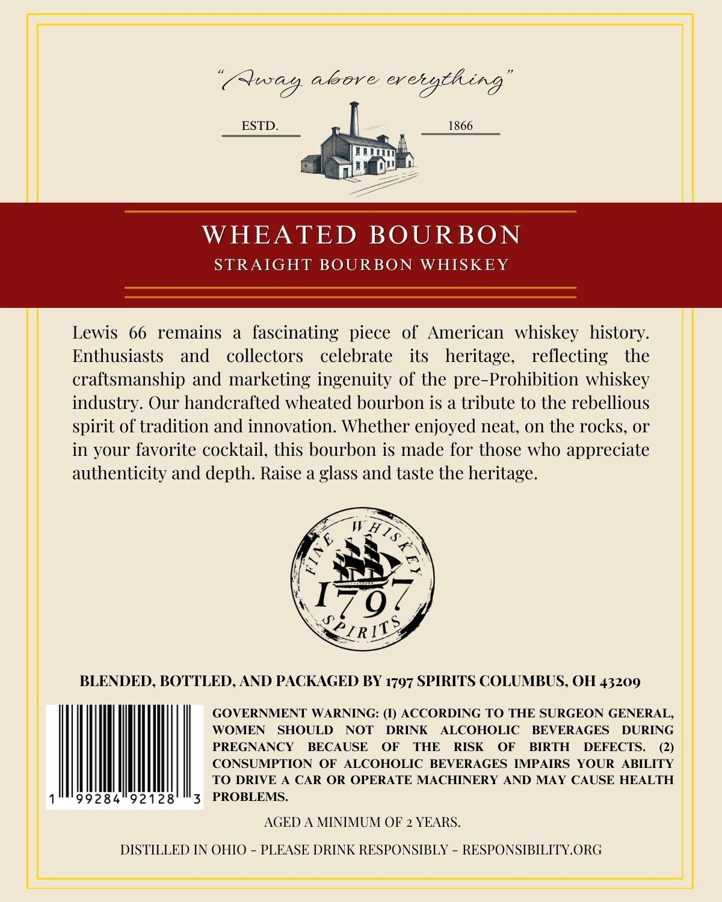
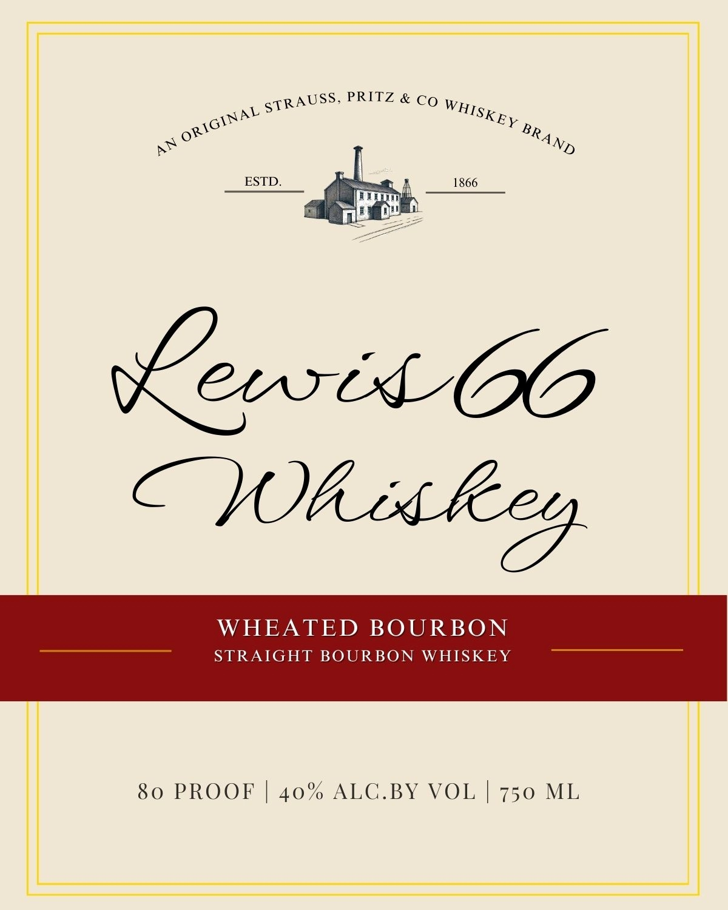

# TTB COLA Label Images - TTBID 26049001000276

**Brand Name:** LEWIS 66

**Issue Date:** 02/19/2026

**Origin Code:** 09

**Product Class/Type:** 101

**Source:** [TTB Public COLA Registry](https://ttbonline.gov/colasonline/viewColaDetails.do?action=publicFormDisplay&ttbid=26049001000276)

## Label Images

### Back Label

### Front Label

## Extracted Label Text

*Text extracted via OCR - may contain errors*

### Back Label

(Cag. abore cretgch rg ‘“

ESTD.

1866

hi

——

WHEATED BOURBON

STRAIGHT BOURBON WHISKEY

Lewis 66 remains a fascinating piece of American whiskey history.

Enthusiasts and collectors celebrate its heritage,

reflecting the

craftsmanship and marketing ingenuity of the pre-Prohibition whiskey

industry. Our handcrafted wheated bourbon is a tribute to the rebellious

spirit of tradition and innovation. Whether enjoyed neat, on the rocks, or

in your favorite cocktail, this bourbon is made for those who appreciate

authenticity and depth. Raise a glass and taste the heritage.

EWaA>

a>

\N

19

by

CRIT

Ds

BLENDED, BOTTLED, AND PACKAGED BY 1797 SPIRITS COLUMBUS, OH 43209

GOVERNMENT WARNING: (1) ACCORDING TO THE SURGEON GENERAL,

WOMEN SHOULD

NOT DRINK ALCOHOLIC BEVERAGES DURING

PREGNANCY BECAUSE OF THE RISK OF BIRTH DEFECTS.

Q)

CONSUMPTION OF ALCOHOLIC BEVERAGES IMPAIRS YOUR ABILITY

TO DRIVE A CAR OR OPERATE MACHINERY AND MAY CAUSE HEALTH

9

8

92128! !'3 PROBLEMS.

AGED A MINIMUM OF 2 YEARS.

DISTILLED IN OHIO - PLEASE DRINK RESPONSIBLY - RESPONSIBILITY.ORG

### Front Label

a sTRAUSS, PRITZ & CO Wise

10)

Ke

be

Ry

ESTD.

1866

wl

Bob

pce

a

CLL

WHEATED BOURBON

STRAIGHT BOURBON WHISKEY

80 PROOF | 40% ALC.BY VOL | 750 ML
