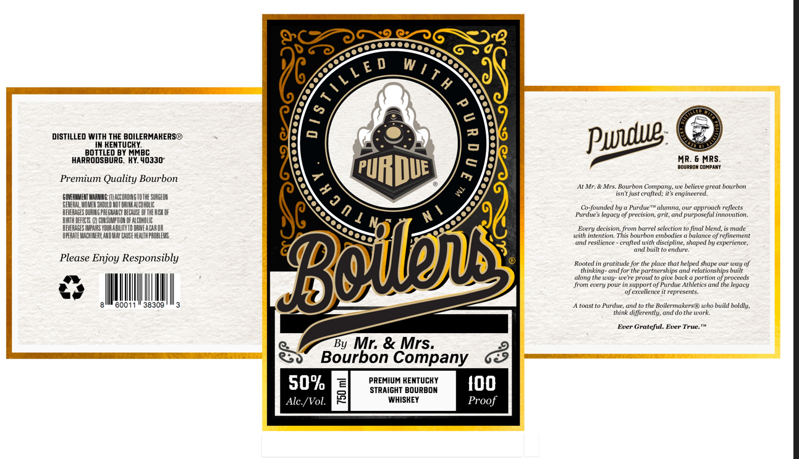
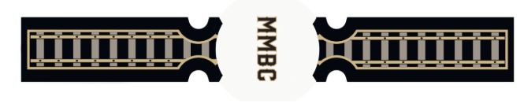
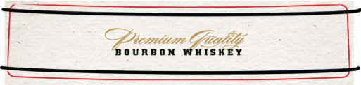

# TTB COLA Label Images - TTBID 26049001000374

**Brand Name:** BY MR. & MRS. BOURBON COMPANY

**Fanciful Name:** BOILERS

**Issue Date:** 02/20/2026

**Origin Code:** 22

**Product Class/Type:** 101

**Source:** [TTB Public COLA Registry](https://ttbonline.gov/colasonline/viewColaDetails.do?action=publicFormDisplay&ttbid=26049001000374)

## Label Images

### Label 1

### Label 2

### Label 3

## Extracted Label Text

*Text extracted via OCR - may contain errors*

*1 image(s) excluded: text did not meet readability threshold*

### Label 1

DISTILLED WITH THE BOILERMAKERS®
IN RENTUCRY.
BOTTLED BY MMBC.
HARRODSBURG, RY.40330°

Premium Quality Bourbon

oem an (Ac ono oT SRE
‘ERA, WOMEN SU KT DNA AcoROUE
‘NAGS Bo REGAN ECUSE FTA IF
ne
‘EVERAGES MARS YOUR ABI ORWE ACAROR
PAE MACHER AED AYA UES.

Please Enjoy Responsibly

a I

60011 " 3830:

GS

By Mr. & Mrs.
Bourbon Company

50% PREMIUM KENTUCKY
0 STRAIGHT BOURBON
Ale./Vol. WHISKEY

&

MR. 6 MRS.

0UR@ON COMPANT

At Mr. & Mrs. Bourbon Company, we believe great bourbon
isnt just crafted; is engineered.

Co-founded by a Purdue™ alumna, our approach reflects
Purdue’s legacy of precision, grit, and purposeful innovation.

ery decision, from barrel selection to final blend, is made

with intention. This bourbon embodies a balance of refinement

‘and resilience - crafted with discipline, shaped by experience,
‘and buil to endure

Rooted in gratitude forthe place that helped shape our way of
‘thinking and for the partnerships and relationships built
‘along the way- we're proud to give back a portion of proceeds
Jrom every pour in support of Purdue Athletics and the legacy
“ofexcellence it represents

A toast to Purdue, and tothe Boilermakers® who build boldly,
‘think differently, and do the work

Ever Grateful. Ever True.™

### Label 3

premium Galil
Zz shee

OURBON WHISKEY
