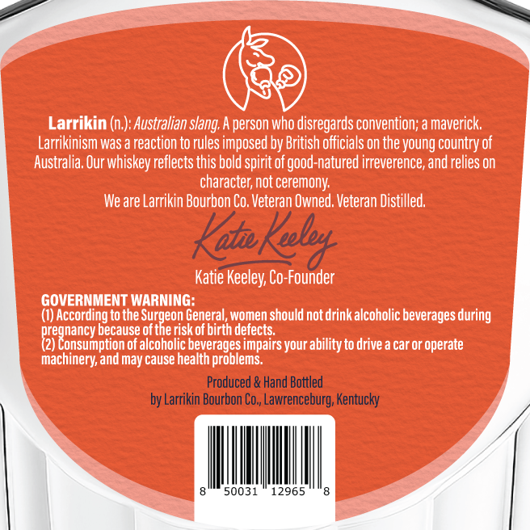
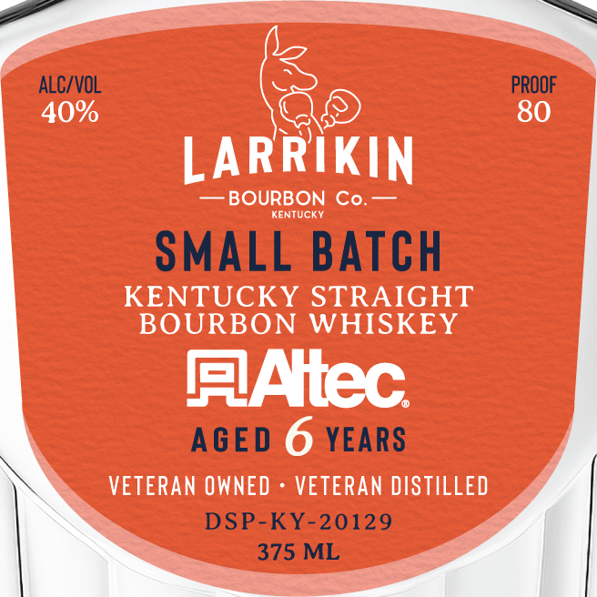

# TTB COLA Label Images - TTBID 26049001000452

**Brand Name:** LARRIKIN BOURBON CO

**Fanciful Name:** SMALL BATCH

**Issue Date:** 02/20/2026

**Origin Code:** 22

**Product Class/Type:** 101

**Source:** [TTB Public COLA Registry](https://ttbonline.gov/colasonline/viewColaDetails.do?action=publicFormDisplay&ttbid=26049001000452)

## Label Images

### Back Label

### Front Label

## Extracted Label Text

*Text extracted via OCR - may contain errors*

### Back Label

Larrikin (n.): Australian slang. A person who disregards convention; a maverick.
Larrikinism was a reaction to rules imposed by British officials on the young country of
Australia, Our whiskey reflects this bold spirit of good-natured irreverence, and relies on
character, not ceremony.
We are Larrikin Bourbon Co, Veteran Owned. Veteran Distilled.

Kali Ke

=
Katie Keeley, Co-Founder
GOVERNMENT WARNING:
(1) According to the eee General, women should not drink alcoholic beverages during
sai because of the risk of birth defects. = >
fy onsumption of alcoholic beverages impairs your ability to drive a car or operate
machinery, and may cause health problems.
Produced & Hand Bottled
by Larrikin Bourbon Co,, Lawrenceburg, Kentucky

### Front Label

ALC/VOL

PROOF

40%

80

6

LARRIKIN

— BOURBON Co. —

KENTUCKY

SMALL BATCH

KENTUCKY STRAIGHT

BOURBON WHISKEY

FlAitec

AGED YEARS

VETERAN OWNED - VETERAN DISTILLED

DSP-KY-20129

375 ML
