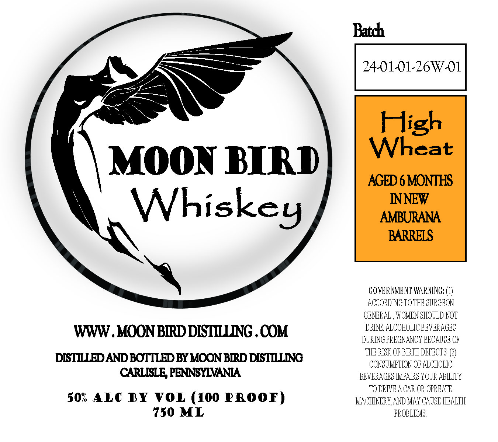

# TTB COLA Label Images - TTBID 26049001000462

**Brand Name:** MOON BIRD WHISKEY

**Fanciful Name:** HIGH WHEAT
AGED 6 MONTHS IN NEW AMBURANA BARRELS

**Issue Date:** 02/25/2026

**Origin Code:** 39

**Product Class/Type:** 140

**Source:** [TTB Public COLA Registry](https://ttbonline.gov/colasonline/viewColaDetails.do?action=publicFormDisplay&ttbid=26049001000462)

## Label Images

### Label 1

## Extracted Label Text

*Text extracted via OCR - may contain errors*

**Detected Proof:** 100

### Label 1

Batch
, : 24.01-01-26W-01
7 Sa
Je
<_..o
t
: IsxKe y
‘~ GOVERNMENT WARNING: (1)
ACCORDING TOTHE SURGEON
GENERAL , WOMEN SHOULD NOT
www DRINK ALCOHOLICBEVERAGES
- MOON BIRD DISTILLING .COM DURING PREGNANCY BECAUSE OF
THE RISK OF BIRTH DEFECTS (2)
DISTILLED AND BOTTLED BY MOON BIRD DISTILLING CONSTMPTIONRATOHOLTC
CARLISLE, PENNSYLVANIA BEVERAGES IMPAIRS YOUR ABILITY
, TODRIVEACAR OR OPREATE
50% ALC BY VOL (100 PROOF) MACHINERY, AND MAY CAUSE HEALTH
7350 ML PROBLEMS
