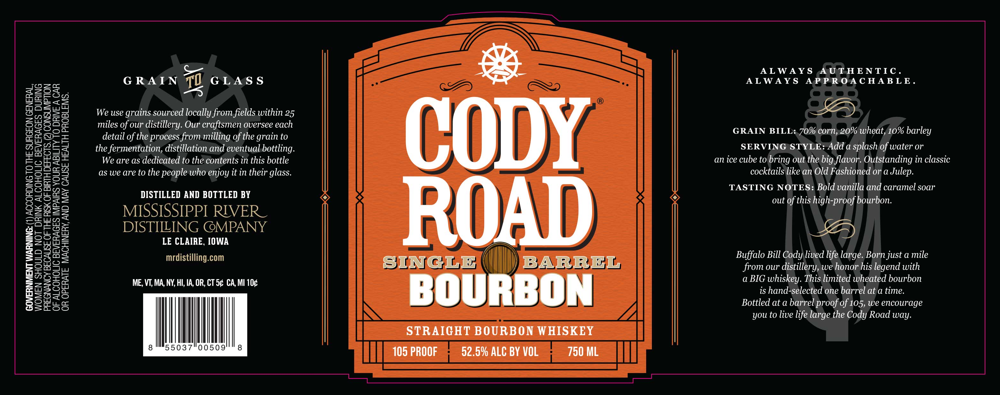

# TTB COLA Label Images - TTBID 26049001000470

**Brand Name:** CODY ROAD SINGLE BARREL BOURBON

**Issue Date:** 02/23/2026

**Origin Code:** 20

**Product Class/Type:** 101

**Source:** [TTB Public COLA Registry](https://ttbonline.gov/colasonline/viewColaDetails.do?action=publicFormDisplay&ttbid=26049001000470)

## Label Images

### Label 1

## Extracted Label Text

*Text extracted via OCR - may contain errors*

### Label 1

GOVERNMENT WARNING: (1) ACCORDING TO THE SURGEON GENERAL,
WOMEN SHOULD NOT DRINK ALCOHOLIC BEVERAGES DURING
PREGNANCY BECAUSE OF THE RISK OF BIRTH DEFECTS. (2) CONSUMPTION
OF ALCOHOLIC BEVERAGES IMPAIRS YOUR ABILITY TO DRIVE A CAR
OR OPERATE MACHINERY, AND MAY CAUSE HEALTH PROBLEMS.

Cc
GRAIN 77 GLASS
0

We use grains sourced locally from fields within 25
miles of our distillery. Our craftsmen oversee each
detail of the process from milling of the grain to
the fermentation, distillation and eventual.bottling.
We are as dedicated to the contents in this bottle
as we are to the people who enjoy it in their glass.

DISTILLED AND BOTTLED BY

MISSISSIPPI RIVER

DISTILING @MPANY
LE CLAIRE, IOWA

mrdistilling.com

ME, VT, MA, NY, HI, 1A, OR, CT S¢ CA, MI 10¢

gue 8

8 °"55037°0050

CODY
ROAD

SINGLE BARREL

STRAIGHT BOURBON WHISKEY
52.5% ALC BY VOL

ALWAYS AUTHENTIC.
ALWAYS APPROACHABLE.

ED

GRAIN BILL:,70% corn,;20% wheat,10% barley
SERVING)STYLE: Add a splash of water or
an ice cube to bring out the big flavor. Outstanding in classic
cocktails like an Old Fashioned or a Julep.
TASTING NOTES: Bold vanilla and caramel soar
out of this high-proof bourbon.

5)

Buffalo Bill Cody lived life large. Born just a mile
from our distillery, we honor his legend with
a BIG whiskey. This limited wheated bourbon
is hand-selected one barrel at a time.
Bottled at a barrel proof of 105, we encourage
you to live life large the Cody Road way.
