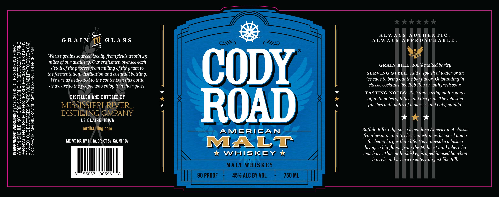

# TTB COLA Label Images - TTBID 26049001000646

**Brand Name:** CODY ROAD MALT

**Issue Date:** 02/23/2026

**Origin Code:** 20

**Product Class/Type:** 118

**Source:** [TTB Public COLA Registry](https://ttbonline.gov/colasonline/viewColaDetails.do?action=publicFormDisplay&ttbid=26049001000646)

## Label Images

### Label 1

## Extracted Label Text

*Text extracted via OCR - may contain errors*

### Label 1

GOVERNMENT WARNING: (1) ACCORDING TO THE SURGEON GENERAL,
WOMEN SHOULD NOT DRINK ALCOHOLIC BEVERAGES DURING
PREGNANCY BECAUSE OF THE RISK OF BIRTH DEFECTS. (2) CONSUMPTION
OF ALCOHOLIC BEVERAGES IMPAIRS YOUR ABILITY TO DRIVE A CAR
OR OPERATE MACHINERY, AND MAY CAUSE HEALTH PROBLEMS.

GS
GRAIN 77 GLASS
iD

We use grains sourced locally from fields within 25
miles of our distillery. Our craftsmen oversee each
detail of the process from milling ofthe grain to
the fermentation, distillation and eventual bottling.
We are as dedicated to the contentsin this bottle
as we are to the people who enjoy it in their glass.

DISTILLED AND BOTTLED BY

MISSISSIPRI REVER_
DISTIEEYNG (SMPANY

LE CLAIRE, 1OWA
mrdistilling.com

ME, VT, MA, NY, HI, 1A, OR, CT S¢ CA, MI 10¢

8 55037 00596 8

DY

AMERICAN

MALT

kK WHISKEY *

S———_ FO eae

ALWAYS AUTHENTIC.
ALWAYS APPROACHABLE.

bd

GRAIN BILL: 100% malted barley

SERVING STYLE: Adda splash of water or an
ice cube to bring out the big flavor. Outstanding in
classic cocktails like Rob Roy or with fresh sour.

TASTING NOTES: Rich and earthy malt rounds
off with notes of toffee and dry fruit. The whiskey
finishes with notes of molasses and oaky vanilla.

kaw *

Buffalo Bill Cody was a legendary American. A classic
frontiersman and tireless entertainer, he was known
for being larger than life. His namesake whiskey
brings a big flavor from the Midwest land where he
was born. This malt whiskey is aged in used bourbon
barrels and is sure to entertain just like Bill.
