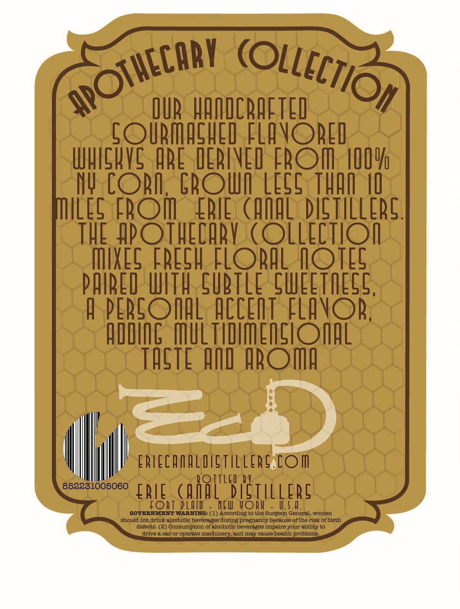
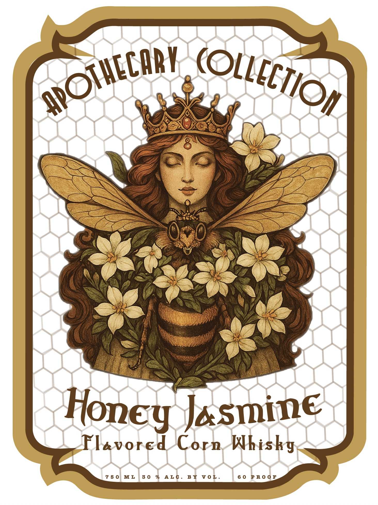

# TTB COLA Label Images - TTBID 26049001000850

**Brand Name:** APOTHECARY

**Issue Date:** 03/31/2026

**Origin Code:** 02

**Product Class/Type:** 149

**Source:** [TTB Public COLA Registry](https://ttbonline.gov/colasonline/viewColaDetails.do?action=publicFormDisplay&ttbid=26049001000850)

## Label Images

### Back Label

### Front Label

## Extracted Label Text

*Text extracted via OCR - may contain errors*

*1 image(s) excluded: text did not meet readability threshold*

### Back Label

QUR HAODCRAFTED
LOIRMAGHED FLAVOREI
WhIGKVS ARE DERIVED FROM 40IU_
NV COR;
GROII LEGS THAO M0
IlLEG FboI
ERIE  (AMAL DictiLLERG.
THE #POTHECHRV (OLLECtIOI
MXES FREgH FLORIL IOTEC
PAIRED uITh 5UBTLE GWEETIEGS,
0 PERIOIAL ACCEOT FLAVOR;
AIDIG MuLTIDIMEISIOHAL
ThsTE An AROMA
ED
ERLECaaligtLLERg.COM
V
852231005060
ERIE
(AR[S Eiillere
fOpT PLAI
MEI iORH
U.S0_
GOvARNMENT WARNING: (1) According to the Burgeon General women
should not drink alcoholic beverageg during pregnancy because Of the risk of birth
defects: (2) Consumption of alcoholic beverages impairg yOur ability to
drive & CAT Or operate machinery and may cause health problemg
APOTHECARY
(OLLICTIOI
