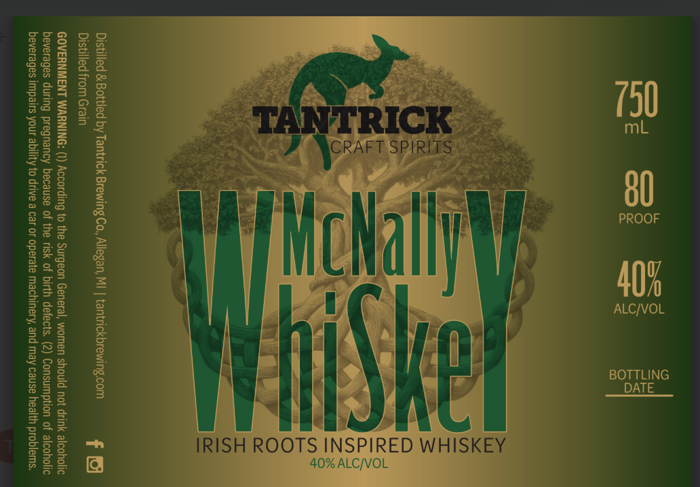

# TTB COLA Label Images - TTBID 26049001000866

**Brand Name:** MCNALLY WHISKEY

**Issue Date:** 03/02/2026

**Origin Code:** 06

**Product Class/Type:** 140

**Source:** [TTB Public COLA Registry](https://ttbonline.gov/colasonline/viewColaDetails.do?action=publicFormDisplay&ttbid=26049001000866)

## Label Images

### Label 1

## Extracted Label Text

*Text extracted via OCR - may contain errors*

**Detected Proof:** 80

### Label 1

s52 oo

22

sas

B26

aaz

335

Som

ra

33

BBs

Fe

ssa

x28

See

foes

fa tt.

Suz

S32

1\G

S&F

4

fl

Ge

nie

I

gs

s8

se

a

Se

zea

$8s

2a

a

al

80

86

ess

Wy

PROOF

Q3

aa)

Sze

22s

wag

BoS

|

Ba

se

Fae

838

40%

ALC/VOL

Zs

ae

Bes

202

388

}

= Se

Ze

Ses

85

B5e

BENG

zee

Ess

im | i]

L] p/

PY) fo

sss

See

IRISH ROOT

NSPIRED WHISKEY

338

x

ALC

VOL
