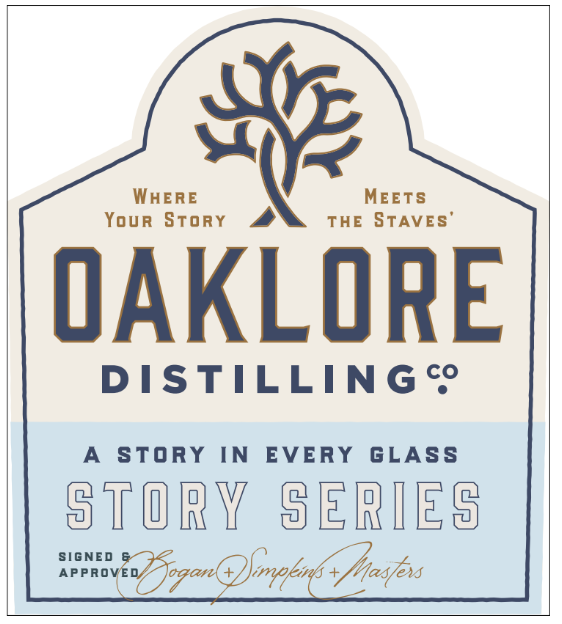
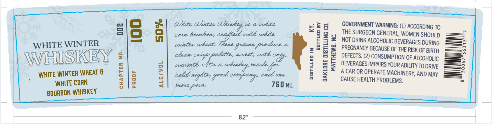

# TTB COLA Label Images - TTBID 26050001000159

**Brand Name:** OAKLORE DISTILLING CO.

**Fanciful Name:** WHITE WINTER WHISKEY

**Issue Date:** 03/12/2026

**Origin Code:** 35

**Product Class/Type:** 141

**Source:** [TTB Public COLA Registry](https://ttbonline.gov/colasonline/viewColaDetails.do?action=publicFormDisplay&ttbid=26050001000159)

## Label Images

### Label 1

### Label 2

### Label 3

## Extracted Label Text

*Text extracted via OCR - may contain errors*

### Label 1

WheRE
MEETS
Your Story
THE STAVES
OAKLORE
DISTILLING c
StoRY
IN
EVERY
GLASS
STORY
SERIES
SIGNED
APPROVED
JogonG2fpkne+ /esfs

### Label 2

storY
StoRY IN
EVERY
GLASS
SERIES

### Label 3

—

Nata Whitar Whe

wa while

~

<o

> m

GOVERNMENT WARNING: (1) ACCORDING TO

Com bourbon,

wih white

THE SURGEON GENERAL, WOMEN SHOULD

NOT DRINK ALCOHOLIC BEVERAGES DURING

=—»

WHITE WINTER

ig teat These grasa produce a

za

=——vo

—————

, eweel, with

PREGNANCY BECAUSE OF THE RISK OF BIRTH

DEFECTS. (2) CONSUMPTION OF ALCOHOLIC

WIHISWIBY

BEVERAGES IMPAIRS YOUR ABILITY TO DRIVE

—o

waunth. Mes a cohsihey

\

WHITE WINTER WHEAT &

A CAR OR OPERATE MACHINERY, AND MAY

>

WHITE CORN

cob neglita, goed company, and one

750 ML

CAUSE HEALTH PROBLEMS,

mere Poe

BOURBON WHISKEY

8.2"
