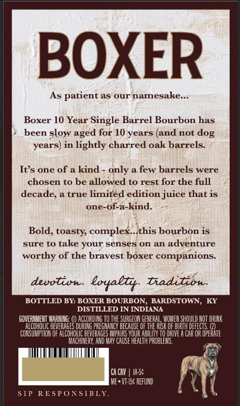
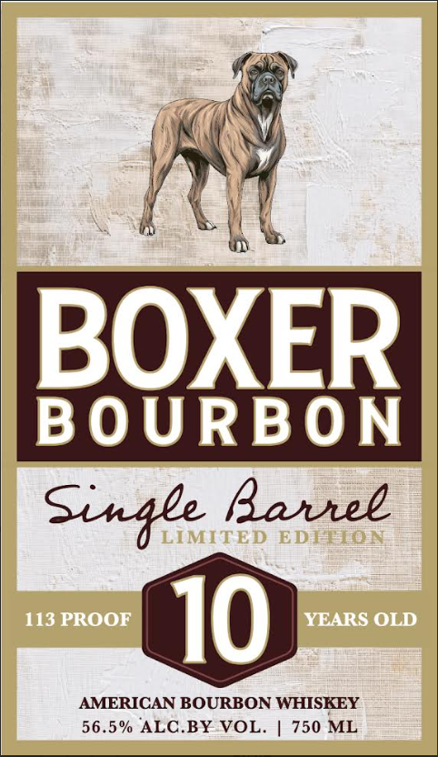

# TTB COLA Label Images - TTBID 26050001000446

**Brand Name:** BOXER BOURBON

**Issue Date:** 02/20/2026

**Origin Code:** 22

**Product Class/Type:** 141

**Source:** [TTB Public COLA Registry](https://ttbonline.gov/colasonline/viewColaDetails.do?action=publicFormDisplay&ttbid=26050001000446)

## Label Images

### Back Label

### Front Label

## Extracted Label Text

*Text extracted via OCR - may contain errors*

### Back Label

BOXER

As patient as’our namesake..

Boxer 10 Year Single Barrel Bourbon has

+ been slow aged for 10 years (and not dog

years) in lightly charred oak barrels.

It’s one of a kind - only a few barrels were

chosen to be allowed to rest for the full

decade, a true limited edition juice that is

one-of-a-kind.

Bold, toasty, complex..:this bourbon is

sure to take your senses on an adyenture

worthy of the bravest boxer companions.

devotion. loyalty. Tradition

BOTTLED BY: BOXER BOURBON, BARDSTOWN,

DISTILLED IN INDIANA

‘WARNING: I) ACCORDING TO THE SURGEON GENERAL WOMEN SHOULD NOT DRINK

COHOI

ERAGES DURING

ICY BECAUSE OF THE RISK OF BIRTH DEFECTS. (2)

‘CONSUMPTION OF ALCOHOLIC BEVERAGES IMPAIRS YOUR ABILITY TO DRIVE A CAR OR OPERATE

IACHINERY, AND MAY CAUSE HEALTH PROBLEM

CACRY | ASE

ME* VI-I5¢ REFUND

q

SIP

R

PONSIBLY

(

### Front Label

IN

;

:

B

XER

BOURBON

Single Barrel

AMERICAN BOURBON WHISKEY

56.5% ALC.BY VOL. | 750 ML
