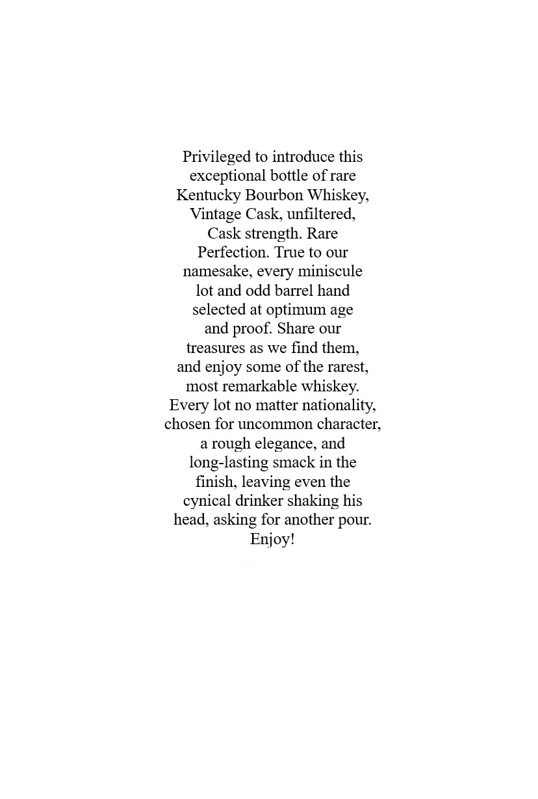
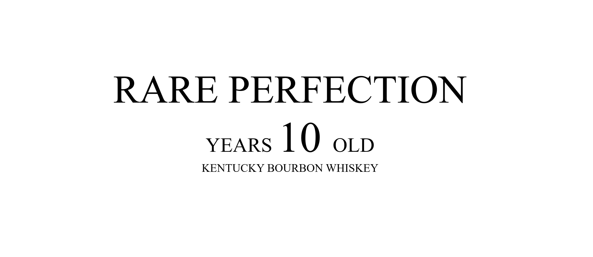
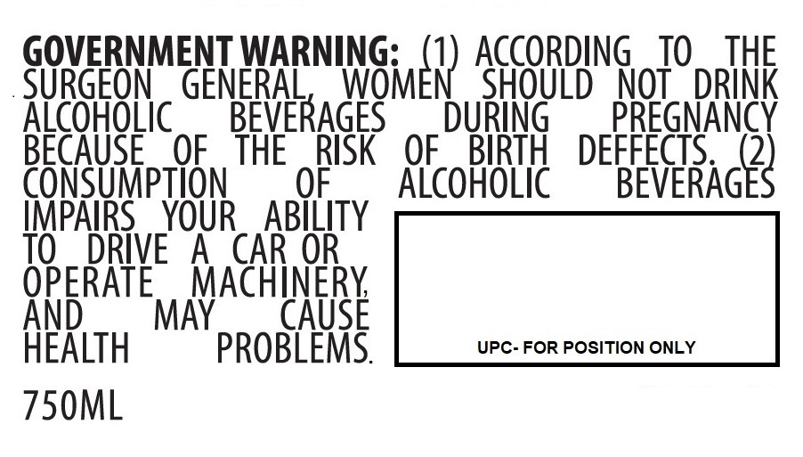

# TTB COLA Label Images - TTBID 26050001000812

**Brand Name:** RARE PERFECTION

**Issue Date:** 02/20/2026

**Origin Code:** 22

**Product Class/Type:** 141

**Source:** [TTB Public COLA Registry](https://ttbonline.gov/colasonline/viewColaDetails.do?action=publicFormDisplay&ttbid=26050001000812)

## Label Images

### Back Label

### Label 1

### Label 2

### Label 4

## Extracted Label Text

*Text extracted via OCR - may contain errors*

### Back Label

Privileged to introduce this

exceptional bottle of rare

Kentucky Bourbon Whiskey,

Vintage Cask, unfiltered,

Cask strength. Rare

Perfection. True to our

namesake, every miniscule

lot and odd barrel hand

selected at optimum age

and proof. Share our

treasures as we find them,

and enjoy some of the rarest,

most remarkable whiskey.

Every lot no matter nationality,

chosen for uncommon character,

a rough elegance, and

long-lasting smack in the

finish, leaving even the

cynical drinker shaking his

head, asking for another pour.

Enjoy!

### Label 1

VINTAGE HERMITAGE

Collection

RARE PERFECTION

KENTUCKY BOURBON WHISKEY

A true connoisseur finds those elusive moments

of Rare Perfection perhaps a handful of times

in life. Before bottling one of our unique treasures,

we make sure all elements flawlessly marry, and the

whiskey inside stands up to our name. To those who

truly appreciate the finest spirits, we dedicate

this ember of brilliance to you.

50.8% alc./vol.

101.6 proof

Hand crafted barrels aged & bottled by:

RARE PERFECTION DISTILLERS

Bardstown, Kentucky

preservationdistillery.com

### Label 2

RARE PERFECTION

YEARS 10 OLD

KENTUCK URBON WHISKEY

### Label 4

GOVERNMENT WARNING:

1) ACCORDING TO THE

SURGEON GENERAL

SHOULD NOT DRINK

ALCOHOLIC

BEVERAGES

DURING

PREGNA

BECAUSE OF THE RISK OF BIRTH DEFFECTS.

NSUMPTION

0

ALCOHOLIC

BEVERAG

x

IMPAIRS YOUR

OPERATE MACHINERY,

HEALTH

PROBLEMS.

750ML
