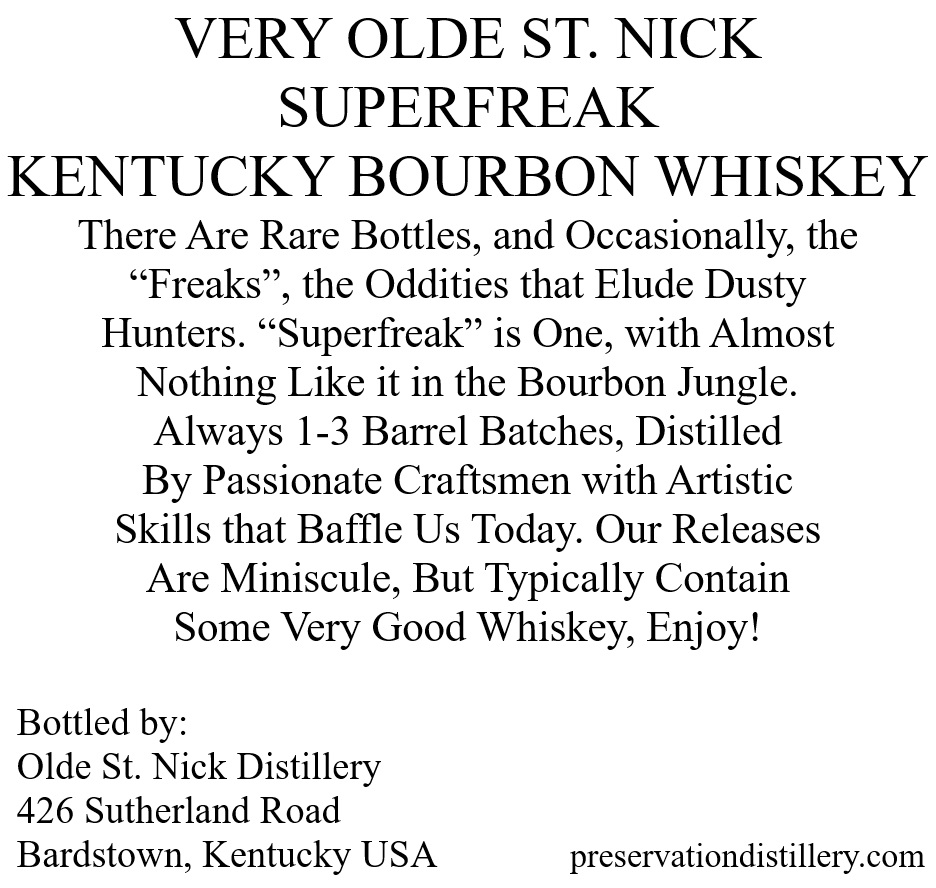
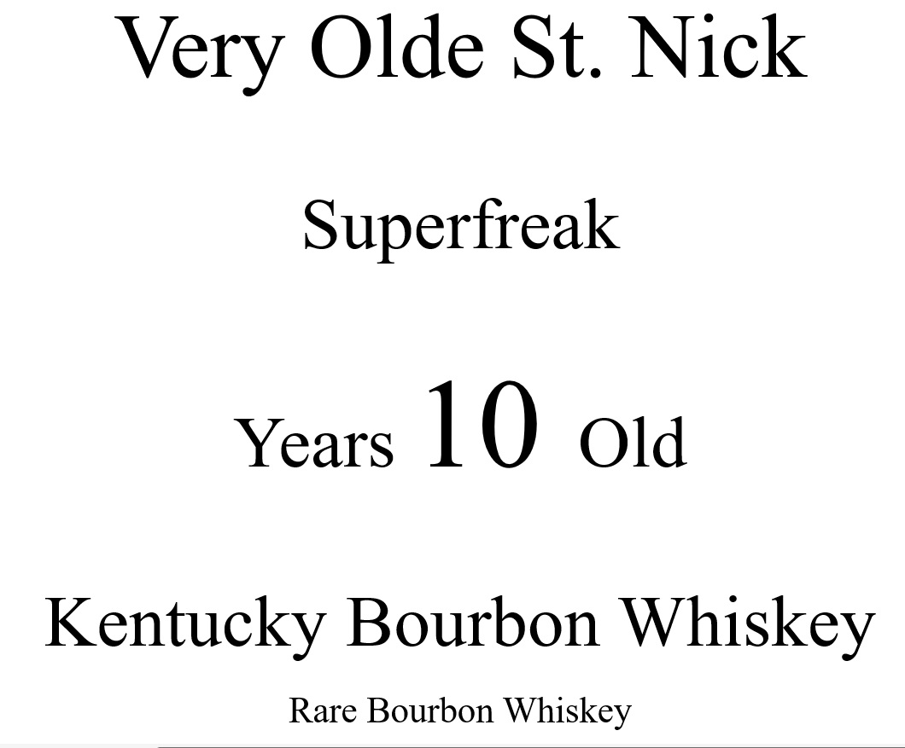
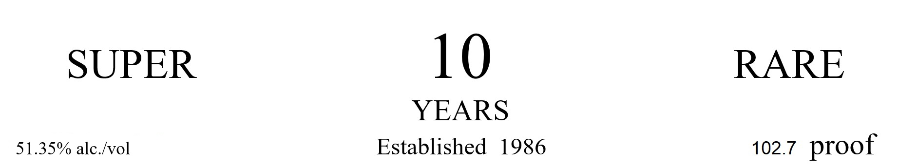
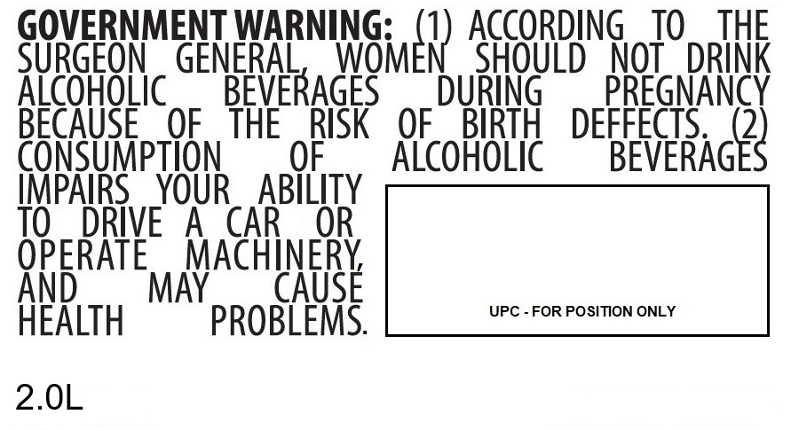
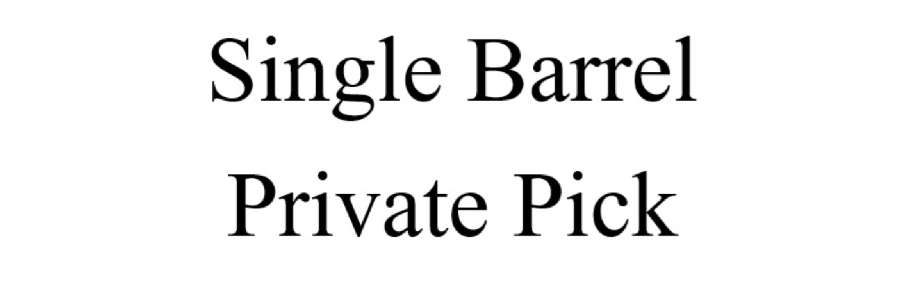

# TTB COLA Label Images - TTBID 26050001000816

**Brand Name:** VERY OLDE ST. NICK

**Fanciful Name:** SUPERFREAK

**Issue Date:** 02/20/2026

**Origin Code:** 22

**Product Class/Type:** 141

**Source:** [TTB Public COLA Registry](https://ttbonline.gov/colasonline/viewColaDetails.do?action=publicFormDisplay&ttbid=26050001000816)

## Label Images

### Back Label

### Label 1

### Label 3

### Label 4

### Label 5

## Extracted Label Text

*Text extracted via OCR - may contain errors*

### Back Label

VERY OLDE ST. NICK

SUPERFREAK

KENTUCKY BOURBON WHISKEY

There Are Rare Bottles, and Occasionally, the

“Freaks”, the Oddities that Elude Dusty

Hunters. “Superfreak”’ is One, with Almost

Nothing Like it in the Bourbon Jungle.

Always 1-3 Barrel Batches, Distilled

By Passionate Craftsmen with Artistic

Skills that Baffle Us Today. Our Releases

Are Miniscule, But Typically Contain

Some Very Good Whiskey, Enjoy!

Bottled by:

Olde St. Nick Distillery

426 Sutherland Road

Bardstown, Kentucky USA

preservationdistillery.com

### Label 1

Very Olde St. Nick

Superfreak

Years 10 Old

Kentucky Bourbon Whiskey

Rare Bourbon Whiskey

### Label 3

SUPER

10

RARE

YEARS

51.35% alc./vol

Established 1986

102.7 proof

### Label 4

GOVERNMENT WARNING

ACCORDING TO THE

SURGEON GENERAL

OM

int

SHOULD NOT DRINK

Aree ge

RA

ING

N

Faith THE RISK OF BIRTH DEFFECTS.

OF

ALCOHOLIC

BEVERAG

s

IMPAIRS YOUR

OPERATE MACHINERY,

AY

C

SE

HEALTH

PROBLEMS.

2.0L

### Label 5

Single Barrel

Private Pick
