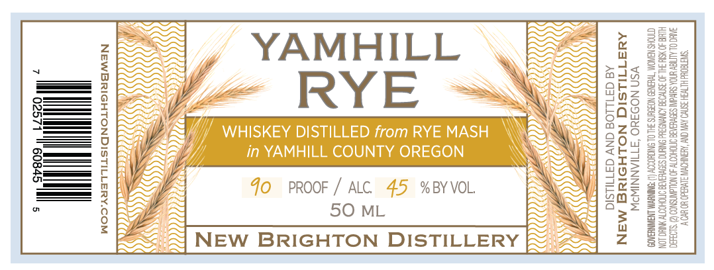

# TTB COLA Label Images - TTBID 26051001000010

**Brand Name:** NEW BRIGHTON DISTILLERY

**Fanciful Name:** YAMHILL RYE

**Issue Date:** 02/20/2026

**Origin Code:** 38

**Product Class/Type:** 140

**Source:** [TTB Public COLA Registry](https://ttbonline.gov/colasonline/viewColaDetails.do?action=publicFormDisplay&ttbid=26051001000010)

## Label Images

### Label 1

## Extracted Label Text

*Text extracted via OCR - may contain errors*

### Label 1

=

YAMHILL

mAs

ode

oz

aED>

RYE

246

SOx

y

2Z

Z0u7

=

y

Y

\

ates

—

(fo

YoOz

ats

% BY VOL.

az

PROOF /' ALC.

\

LOS

50 ML

iN

E
