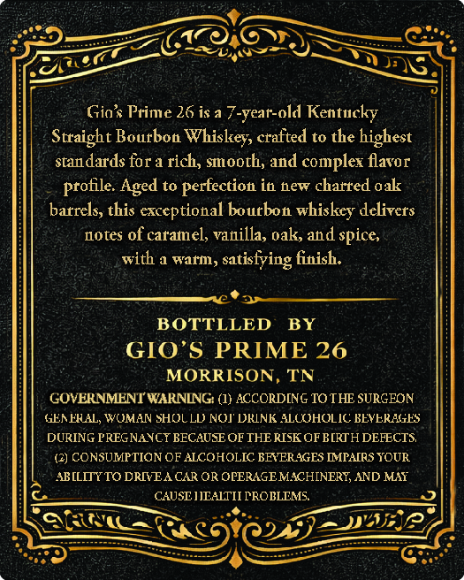
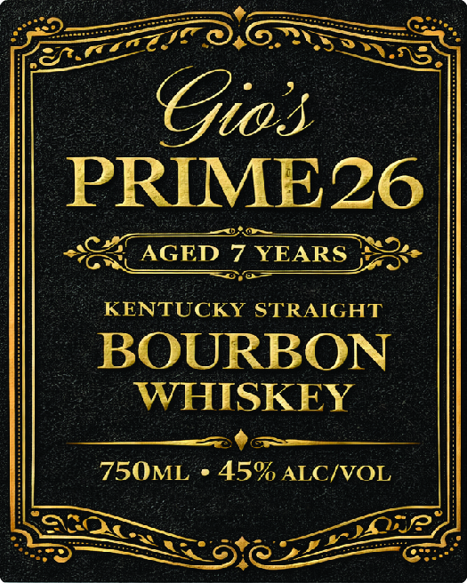

# TTB COLA Label Images - TTBID 26051001000242

**Brand Name:** GIO'S PRIME 26

**Issue Date:** 02/23/2026

**Origin Code:** 43

**Product Class/Type:** 101

**Source:** [TTB Public COLA Registry](https://ttbonline.gov/colasonline/viewColaDetails.do?action=publicFormDisplay&ttbid=26051001000242)

## Label Images

### Back Label

### Front Label

### Label 3

## Extracted Label Text

*Text extracted via OCR - may contain errors*

### Back Label

Cys

Or): es

ay

ee aon

Gio’s Prime 26 is a 7-year-old Kentucky

4

Straight Bourbon Whiskey, crafted to the highest

standards for a rich, smooth, and complex flavor

profile. Aged to perfection in new charred oak

barrels, this exceptional bourbon whiskey delivers

notes of caramel, vanilla, oak, and spice,

with a warm, satisfying finish.

$$$ *

S

BOTTLLED BY

z

GIO’S PRIME 26

MORRISON, TN

GOVERNMENT WARNING: (1) ACCORDING TO THE SURGEON

GENERAL, WOMAN SHOLLD NOY DRINK ALCOHOLIC BEVERAGES:

DURING PREGNANCY BECAUSE OF THE RISK GF BIRTH DEFECTS,

(2) CONSUMPTION OF ALCOHOLIC BEVERAGES IMPAIRS YOUR

ABILITY TO DRIVEA CAR OR OPERAGE MACHINERY, AND MAY

es

CAUSE IEALTII PROBLEMS,

a)

So

St

PP 4

wae

NS

DAs).

=)

### Front Label

(hh

ead

Nos

NS:

COS

PRIME26

GN

:

“KENTUCKY STRAIGHT

~ BOURBON

— WHISKEY

Bee eS

FLU I 45% ALC/VOL

CNet

eo

Sy

$s

92

WP.

SOC

### Label 3

CaN

+ Gros PRIME 26 *2exes)

me
