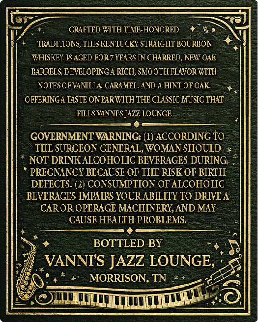
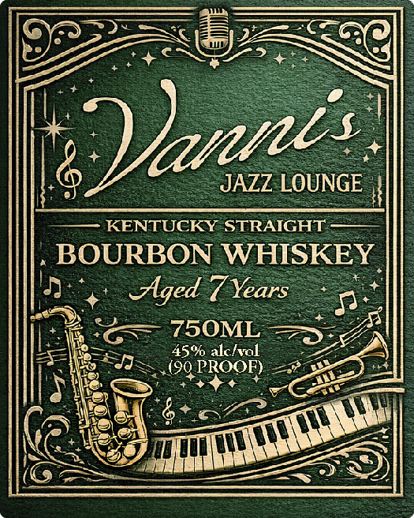
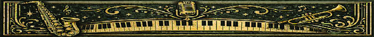

# TTB COLA Label Images - TTBID 26051001000247

**Brand Name:** VANNI'S JAZZ LOUNGE

**Issue Date:** 02/23/2026

**Origin Code:** 43

**Product Class/Type:** 101

**Source:** [TTB Public COLA Registry](https://ttbonline.gov/colasonline/viewColaDetails.do?action=publicFormDisplay&ttbid=26051001000247)

## Label Images

### Back Label

### Front Label

### Label 3

## Extracted Label Text

*Text extracted via OCR - may contain errors*

### Back Label

e

RAFTED WITH TIME-HONORED +

+

TRADE“IONS, THIS KENTUCKY STRAIGHT BOURBON +S

‘WHISKEY IS AGED FOR? YEARS IN CHARRED, NEW OAK

BARRELS, DEVELOPING A RICH, SMOOTH FLAVOR WITH

NOTES OF VANILLA, CARAMEL, AND A HINT OF OAK,

+

OFFERINGA TASTE ON PAR WITH THE CLASSIC MUSIC THAT.

FILLS VANNI'S JAZZ LOUNGE.

=

z

e

GOVERNMENT WARNING: (1) ACCORDING TO.

THE SURGEON GENERAL, WOMAN SHOULD x

* NOT DRINK ALCOHOLIC BEVERAGES DURING. *

* PREGNANCY BECAUSE OF THE RISK OF BIRTH:

DEFECTS. (2) CONSUMPTION OF ALCOHOLIC

BEVERAGES IMPAIRS YOUR ABILITY TO DRIVE A

CAROR OPERAGE MACHINERY, AND MAY.

=

CAUSE HEALTH PROBLEMS

¢

BOTTLED BY

“+

VANNI'S JAZZ LOUNG

MORRISON, TN *+

ci

ve

pe,

LTT]

(0

‘oO

### Front Label

O32

CNN

f

QU

6

KENTUCKY STR

A ———

BOURBON W

In

Aged 7 Ye

sos

730.

—

a

iy SSIS

45% alcivol

BY

=!

an

q

ran

Poe

nes

a

+i

TH

Tet

=

=

oF

—<

eS

### Label 3

=

ey |]

AY

eaecege eee ee ey

SR LSERLLIELIEL A

ARLE
