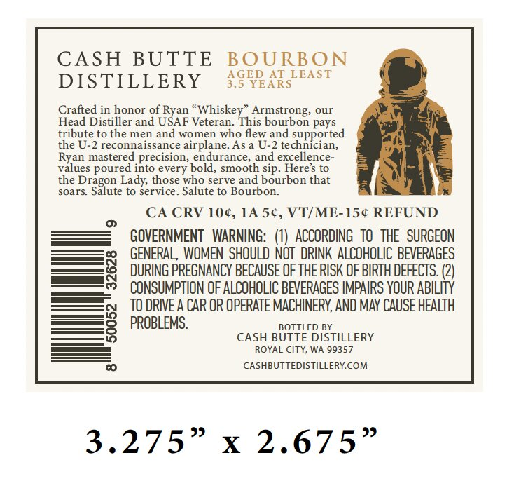
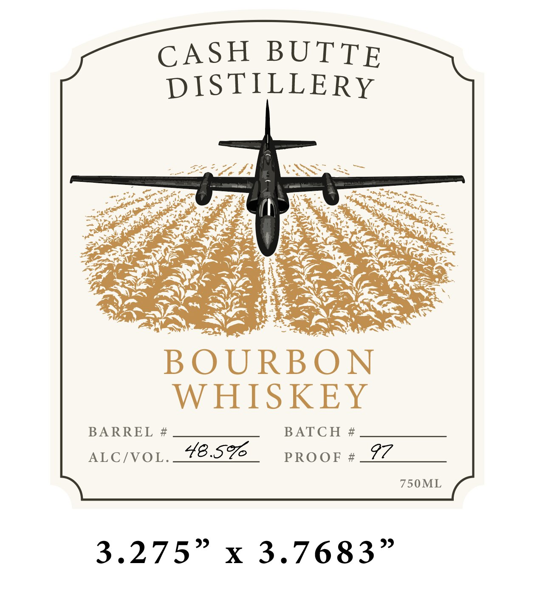

# TTB COLA Label Images - TTBID 26051001000334

**Brand Name:** CASH BUTTE DISTILLERY

**Issue Date:** 02/20/2026

**Origin Code:** 07

**Product Class/Type:** 141

**Source:** [TTB Public COLA Registry](https://ttbonline.gov/colasonline/viewColaDetails.do?action=publicFormDisplay&ttbid=26051001000334)

## Label Images

### Back Label

### Front Label

## Extracted Label Text

*Text extracted via OCR - may contain errors*

### Back Label

CASH BUTTE BOURBON

AGED AT LEAST

DISTILLERY

3.5 YEARS

Crafted in honor of Ryan “Whiskey” Armstrong, our

Head Distiller and USAF Veteran. This bourbon pays

tribute to the men and women who flew and supported

the U-2 reconnaissance airplane. As a U-2 technician,

Ryan mastered precision, endurance, and excellence-

values poured into every bold, smooth sip. Here's to

the Dragon Lady, those who serve and bourbon that

soars. Salute to service. Salute to Bourbon.

CA CRV 10¢, 1A 5¢, VT/ME-15¢ REFUND

GOVERNMENT WARNING: (1) ACCORDING TO THE SURGEON

GENERAL, WOMEN SHOULD NOT DRINK ALCOHOLIC BEVERAGES

DURING PREGNANCY BECAUSE OF THE RISK OF BIRTH DEFECTS. (2)

CONSUMPTION OF ALCOHOLIC BEVERAGES IMPAIRS YOUR ABILITY

TO DRIVE A CAR OR OPERATE MACHINERY, AND MAY CAUSE HEALTH

PROBLEMS.

BOTTLED BY

CASH BUTTE DISTILLERY

ROYAL CITY, WA 99357

CASHBUTTEDISTILLERY.COM

3.275" % 2.675”

### Front Label

CASH BUTTE
DISTILLERY
5 ee ol See
en 2] | ER Boece
pee? Coy he es
pe ro Ze wee ; ee es 2) . Mia ov =
RY ee Was oe
Tiina ae SOT:
BOURBON
WHISKEY
BARREL # __ ss BATCH #_ ses
ALC/VOL._78-576_ proor#_@Z____
750ML
3.275” x 3.7683”
