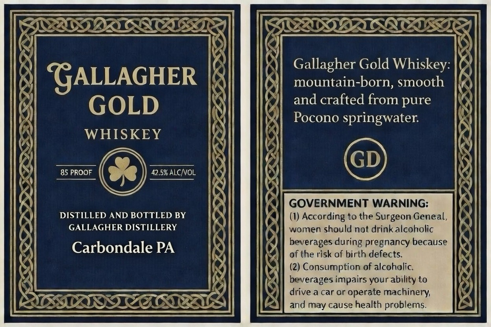

# TTB COLA Label Images - TTBID 26051001000373

**Brand Name:** GALLAGHER GOLD WHISKEY

**Issue Date:** 02/25/2026

**Origin Code:** 39

**Product Class/Type:** 140

**Source:** [TTB Public COLA Registry](https://ttbonline.gov/colasonline/viewColaDetails.do?action=publicFormDisplay&ttbid=26051001000373)

## Label Images

### Label 1

## Extracted Label Text

*Text extracted via OCR - may contain errors*

**Detected Proof:** 85

### Label 1

PATRIA ALNTO SEA

oh)

RL

ZOOM

SSSA,

IS

Gallagher Gold Whiskey: 8
mountain-born, smooth

and crafted from pure
Pocono springwater.

“GALLAGHER |
GOLD

WHISKEY

85 PROOF 42.5% ALC/VOL

DISTILLED AND BOTTLED BY
GALLAGHER DISTILLERY

Carbondale PA

7%"

as
SERS
Ars

LA z

&

KE

“S
2
fm

SZ

GOVERNMENT WARNING:
i} (1) According to the Surgeon Geneal, |}
4)] women should not drink alcoholic

Ds

=

a

| beverages during pregnancy because
bf ]) of the risk of birth defects. |
} (2) Consumption of alcoholic.
beverages impairs your ability to
drive a car or operate machinery,
and may cause health problems.

ESS

¢

la
