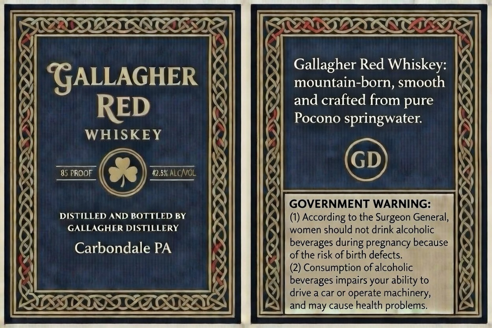

# TTB COLA Label Images - TTBID 26051001000392

**Brand Name:** GALLAGHER RED WHISKEY

**Issue Date:** 02/25/2026

**Origin Code:** 39

**Product Class/Type:** 140

**Source:** [TTB Public COLA Registry](https://ttbonline.gov/colasonline/viewColaDetails.do?action=publicFormDisplay&ttbid=26051001000392)

## Label Images

### Label 1

## Extracted Label Text

*Text extracted via OCR - may contain errors*

**Detected Proof:** 85

### Label 1

RITA SER
f

‘A
Gallagher Red Whiskey: i

“GALLAGHER mountain-born, smooth nN
RED )| and crafted from pure .

Pocono springwater.
WHISKEY

(y
85 PROOF se DSKNCNOL

OVERNMENT WARNING:
DISTILLED AND BOTTLED BY (1) According to the Surgeon General,
GALLAGHER DISTILLERY

women should not drink alcoholic
Carbondale PA

SILEX

eg Se
SS
aS.

a
~
a

BOSS

DLESS

AX
ae

K bY
tS an Ae
) i

SOx rar
ZZ

stavaYa
22
Ss

~~
LSSILITLE

RLoLoe

Ve

beverages during pregnancy because
of the risk of birth defects.

(2) Consumption of alcoholic
beverages impairs your ability to

] drive a car or operate machinery,

Ay) and may cause health problems.

esr

Nee SSS s
wk.

(
‘

7

7

Sz

mi

SILVIO IFF USETR

>

’
