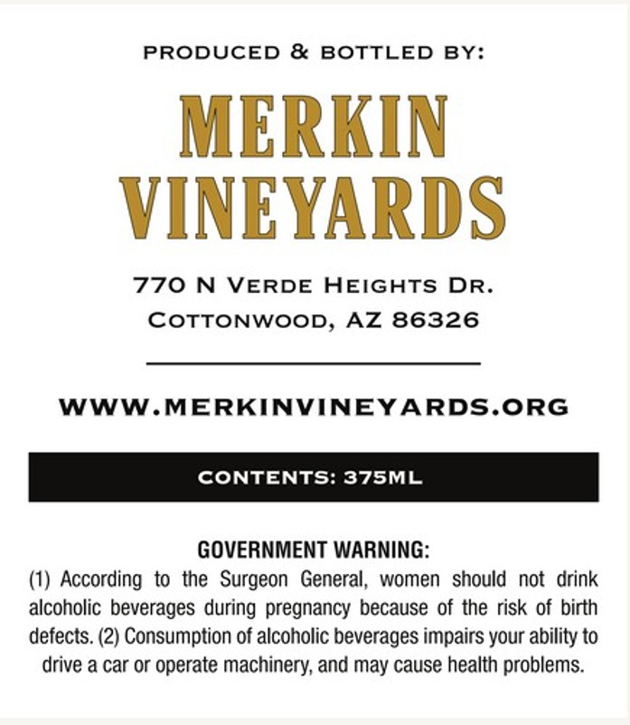
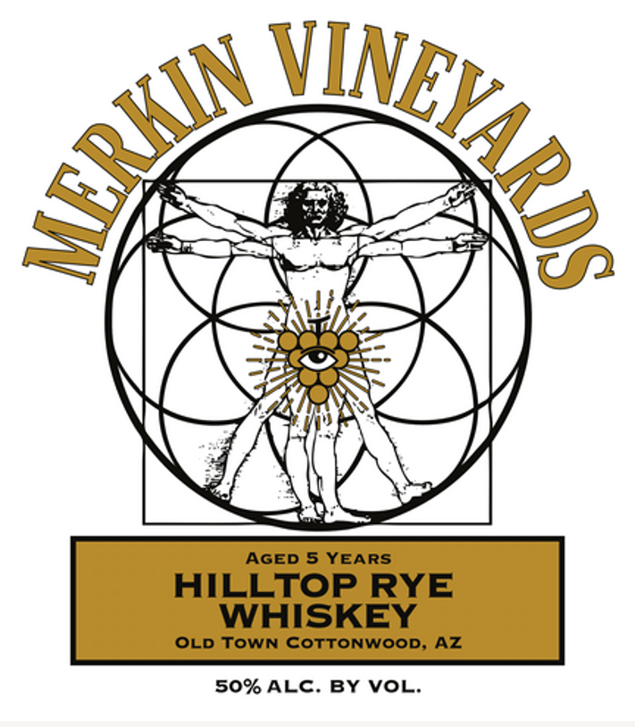

# TTB COLA Label Images - TTBID 26051001000439

**Brand Name:** HILLTOP

**Fanciful Name:** RYE

**Issue Date:** 03/06/2026

**Origin Code:** 11

**Product Class/Type:** 142

**Source:** [TTB Public COLA Registry](https://ttbonline.gov/colasonline/viewColaDetails.do?action=publicFormDisplay&ttbid=26051001000439)

## Label Images

### Back Label

### Front Label

## Extracted Label Text

*Text extracted via OCR - may contain errors*

**Detected Proof:** 100
**Detected Age:** 5 Years

### Back Label

PRODUCED & BOTTLED BY:

MERKIN

VINEYARDS

770 N VERDE HEIGHTS DR.

COTTONWOOD, AZ 86326

WWW.MERKINVINEYARDS.ORG

GOVERNMENT WARNING:

(1) According to the Surgeon General, women should not drink

alcoholic beverages during pregnancy because of the risk of birth

defects. (2) Consumption of alcoholic beverages impairs your ability to

drive a car or operate machinery, and may cause health problems.

### Front Label

AGED 5 YEARS
HILLTOP RYE
WHISKEY
OLD TOWN CoTTOnWOOD, AZ
50% ALC. BY VL:
JEYARDS
(
