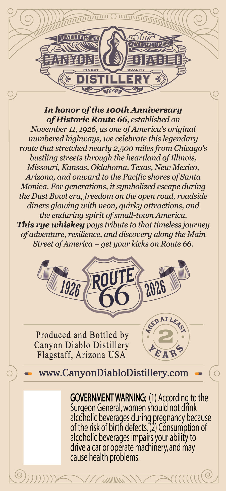
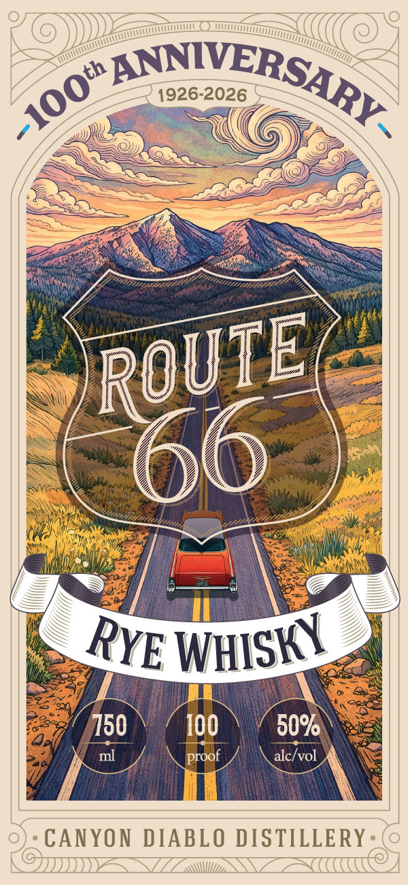

# TTB COLA Label Images - TTBID 26051001000475

**Brand Name:** CANYON DIABLO DISTILLERY

**Fanciful Name:** 100TH ANNIVERSARY ROUTE 66 RYE WHISKY

**Issue Date:** 02/23/2026

**Origin Code:** 11

**Product Class/Type:** 142

**Source:** [TTB Public COLA Registry](https://ttbonline.gov/colasonline/viewColaDetails.do?action=publicFormDisplay&ttbid=26051001000475)

## Label Images

### Back Label

### Front Label

## Extracted Label Text

*Text extracted via OCR - may contain errors*

*1 image(s) excluded: text did not meet readability threshold*

### Back Label

Ti

Ke —
a Z Ev Va <i
Ga py os
TY 7] i TY Tl
CANYON \(©) DIABLO

FINEST

€ DISTILLERY 2)
:

In honor of the 100th Anniversary
of Historic Route 66, established on
November 11, 1926, as one of America's original
numbered highways, we celebrate this legendary
route that stretched nearly 2,500 miles from Chicago's
bustling streets through the heartland of Illinois,
Missouri, Kansas, Oklahoma, Texas, New Mexico,
Arizona, and onward to the Pacific shores of Santa
Monica. For generations, it symbolized escape during
the Dust Bowl era, freedom on the open road, roadside
diners glowing with neon, quirky attractions, and
the enduring spirit of small-town America.
This rye whiskey pays tribute to that timeless journey
of adventure, resilience, and discovery along the Main
Street of America — get your kicks on Route 66.

Ls

(S/—s\
Produced and Bottled by | °° S® y
Canyon Diablo Distillery \ po“ /
Flagstaff, Arizona USA SLAB”

) < www.CanyonDiabloDistillery.com — ( O

GOVERNMENT WARNING: (1) According to the
Surgeon General, women should not drink
alcoholic peas during pregnana) because
of the risk of birth defects, (2) Consumption of
alcoholic beverages impairs your ability to
drive a car or operate machinery, and may
cause health problems,

IV A\\\\II// OA
