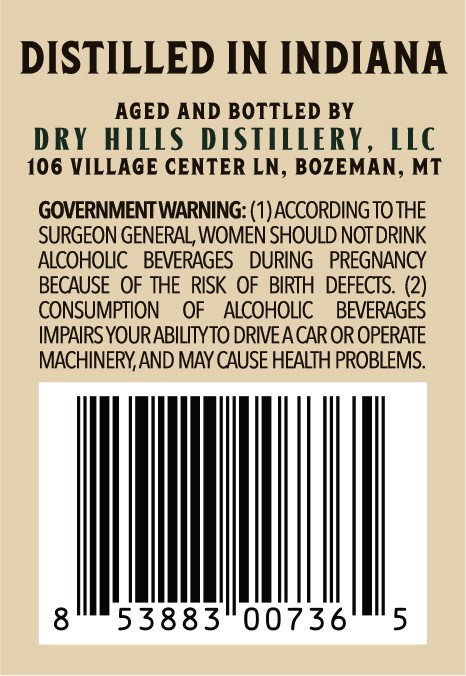
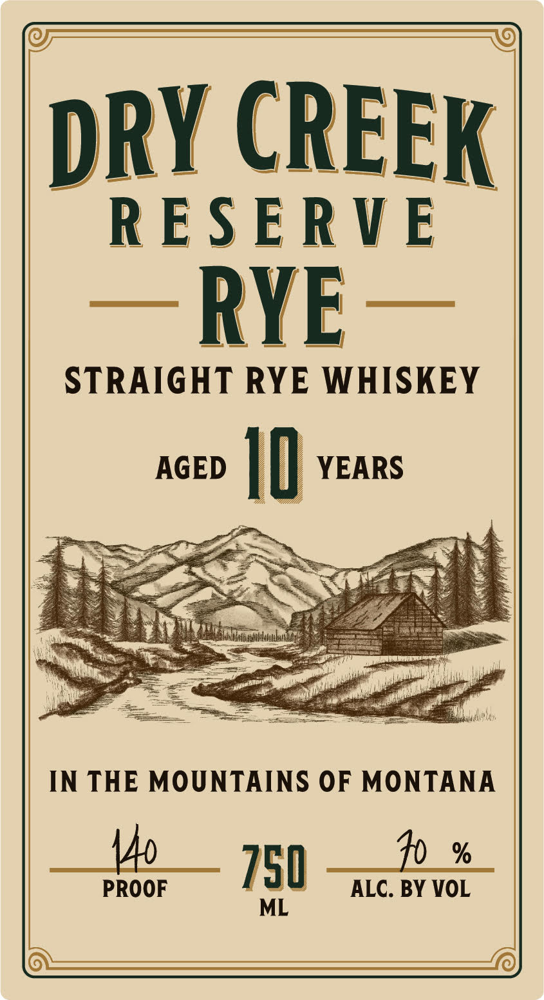

# TTB COLA Label Images - TTBID 26051001000497

**Brand Name:** DRY CREEK RESERVE

**Issue Date:** 02/23/2026

**Origin Code:** 30

**Product Class/Type:** 102

**Source:** [TTB Public COLA Registry](https://ttbonline.gov/colasonline/viewColaDetails.do?action=publicFormDisplay&ttbid=26051001000497)

## Label Images

### Back Label

### Front Label

## Extracted Label Text

*Text extracted via OCR - may contain errors*

### Back Label

DISTILLED IN INDIANA

AGED AND BOTTLED BY

DRY HILLS DISTILLERY, LLC

106 VILLAGE CENTER LN, BOZEMAN, MT

GOVERNMENT WARNING: (1) ACCORDING TO THE

SURGEON GENERAL, WOMEN SHOULD NOT DRINK

ALCOHOLIC BEVERAGES DURING PREGNANCY

BECAUSE OF THE RISK OF BIRTH DEFECTS. (2)

CONSUMPTION OF ALCOHOLIC BEVERAGES

IMPAIRS YOUR ABILITY TO DRIVE A CAR OR OPERATE

MACHINERY, AND MAY CAUSE HEALTH PROBLEMS.

MM

53883 00736

### Front Label

DRY CREEK

RESERVE

— RYE—

STRAIGHT RYE WHISKEY

YEARS

AGED |

aS

oy

Mg

IN THE MOUNTAINS OF MONTANA

PROOF

150 a Srvet ALC. BY val

_  <<<<<_—<_<_/.)
