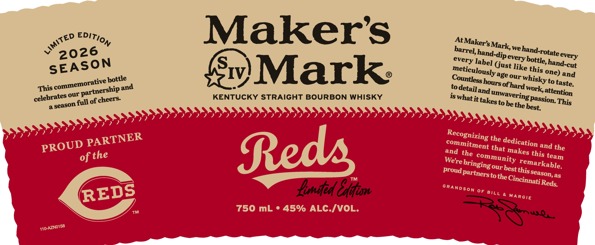
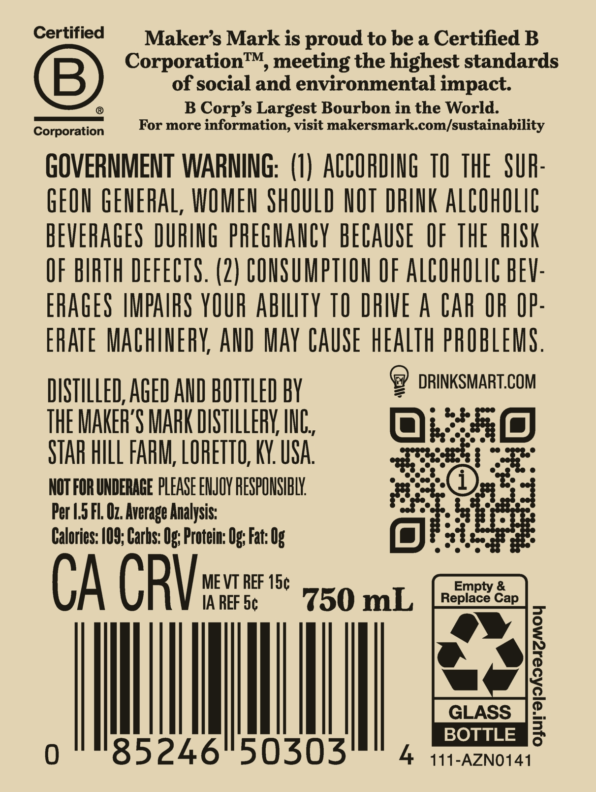

# TTB COLA Label Images - TTBID 26051001000583

**Brand Name:** MAKER'S MARK

**Issue Date:** 02/23/2026

**Origin Code:** 22

**Product Class/Type:** 101

**Source:** [TTB Public COLA Registry](https://ttbonline.gov/colasonline/viewColaDetails.do?action=publicFormDisplay&ttbid=26051001000583)

## Label Images

### Label 1

### Label 2

## Extracted Label Text

*Text extracted via OCR - may contain errors*

### Label 1

<€D EDIT

Maker's

At Maker

Ss Mar!

hand.

2026

barre],

d-di

tate

every

very labe

© hand-cut

SEASON

=

eticulo

Gust like tp;

s ne) and

usly age our whis

This comme’

10)

ative potth

Sw) Mark:

to detai]

ours

ky to taste

ership and

KENTUCKY STRAIGHT BOURBON WHISKY

celebrates a

full £ cheers.

1S What it takes

tobe th, sbassion. This

Lond Cain

Re.

### Label 2

Certified

Maker’s Mark is proud to be a Certified B

Corporation™, meeting the highest standards

of social and environmental impact

©

®

B Corp’s Largest Bourbon in the World.

Corporati

For more information, visit makersmark.com/sustainability

GOVERNMENT WARNING: (1) ACCORDING 10 THE SUR

GEON GENERAL, WOMEN SHOULD NOT DRINK ALCOHOLIC

BEVERAGES DURING PREGNANCY BECAUSE OF THE RISK

OF BIRTH DEFECTS. (2) CONSUMPTION OF ALCOHOLIC BEV

ERAGES IMPAIRS YOUR ABILITY TO DRIVE A CAR OR OP

ERATE MACHINERY, AND MAY CAUSE HEALTH PROBLEMS

9 DRINKSMART.COM

DISTILLED, AGED AND BOTTLED BY

THE MAKER'S MARK DISTILLERY, INC

a)

STAR HILL FARM, LORETTO, KY. USA

awe ce

NOT FOR UNDERAGE PLEASE ENJOY RESPONSIBLY.

Per 1.5 Fl. O7. Average Analysis:

Calories: 109; Carhs: Og; Protein: Og; Fat: 0

ort

CA CRY

MEVT REF 15¢

IA REF 5¢

750 mL

Ml

|

BOTTLE

4A 441-AZNO141
