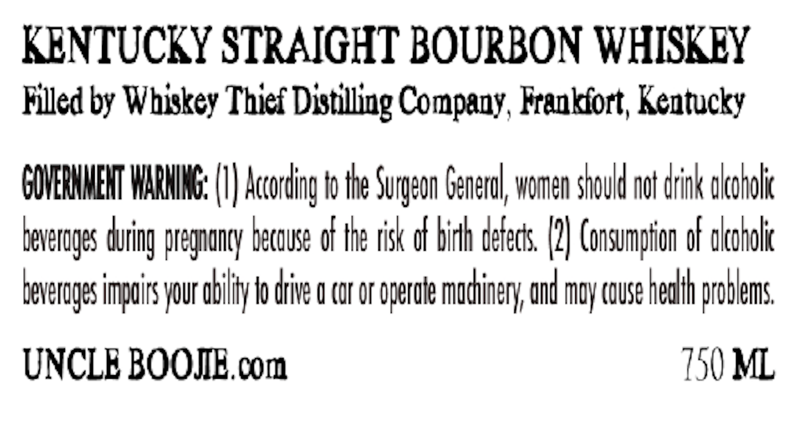
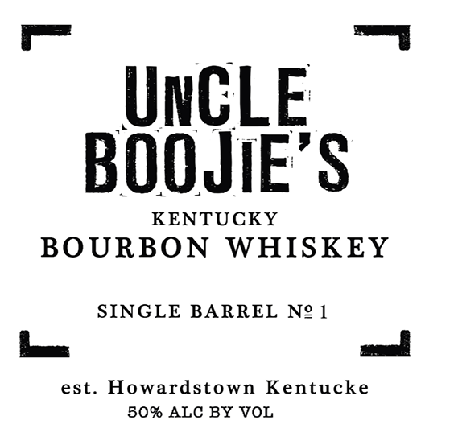

# TTB COLA Label Images - TTBID 26051001000586

**Brand Name:** UNCLE BOOJIE'S

**Issue Date:** 02/26/2026

**Origin Code:** 22

**Product Class/Type:** 141

**Source:** [TTB Public COLA Registry](https://ttbonline.gov/colasonline/viewColaDetails.do?action=publicFormDisplay&ttbid=26051001000586)

## Label Images

### Back Label

### Front Label

## Extracted Label Text

*Text extracted via OCR - may contain errors*

**Detected Proof:** 100

### Back Label

KENTUCKY STRAIGHT BOURBON WHISKEY

Filled by Whiskey Thief Distilling Company, Frankfort, Kentucky

GOVERNMENT WARNING: (I) According to the Surgeon General, women should nat dink okccholic

beverages during pregnancy because of the risk of birh defects, (2) Consumption of alcoholic

beverages impairs your obit fo drive o car or operole machinery, and may couse health problems

UNCLE BOOJE.com

150 ML

### Front Label

"UNCLE

BOOJIE’S

KENTUCKY

BOURBON WHISKEY

SINGLE BARREL N21

a

wall

est. Howardstown Kentucke

50% ALC BY VOL
