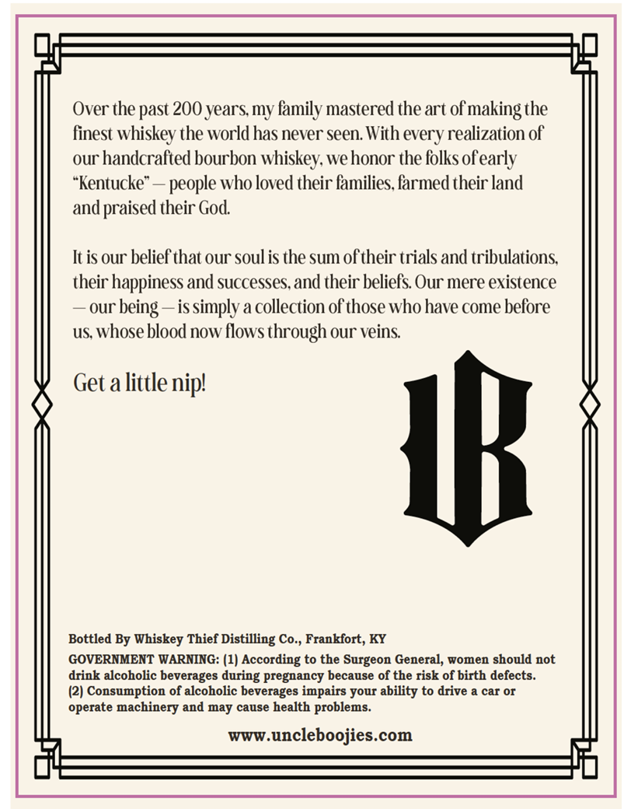
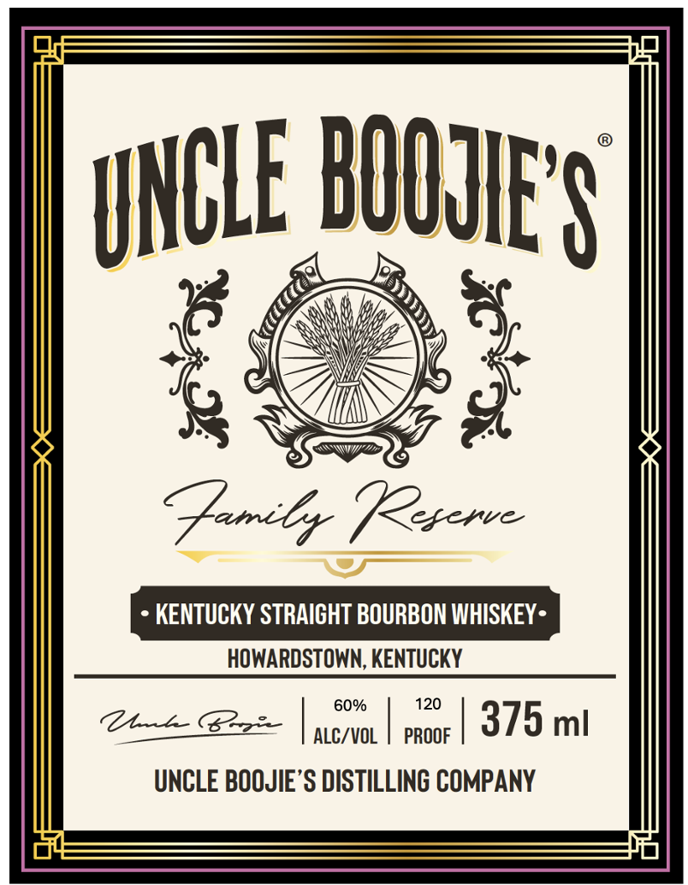
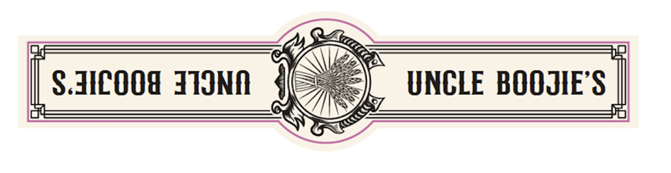

# TTB COLA Label Images - TTBID 26051001000593

**Brand Name:** UNCLE BOOJIE'S

**Fanciful Name:** FAMILY RESERVE

**Issue Date:** 02/27/2026

**Origin Code:** 22

**Product Class/Type:** 101

**Source:** [TTB Public COLA Registry](https://ttbonline.gov/colasonline/viewColaDetails.do?action=publicFormDisplay&ttbid=26051001000593)

## Label Images

### Back Label

### Front Label

### Label 3

## Extracted Label Text

*Text extracted via OCR - may contain errors*

*1 image(s) excluded: text did not meet readability threshold*

### Back Label

Over the past 200 years, my family mastered the art of making the

finest whiskey the world has never seen. With every realization of

our handcrafted bourbon whiskey, we honor the folks of early

“Kentucke” — people who loved their families, farmed their land

and praised their God.

It is our belief that our soul is the sum of their trials and tribulations,

their happiness and successes, and their beliefs. Our mere existence

— our being —is simply a collection of those who have come before

us, whose blood now flows through our veins.

Get alittle nip!

Bottled By Whiskey Thief Distilling Co., Frankfort, KY

GOVERNMENT WARNING: (1) According to the Surgeon General, women should not

drink alcoholic beverages during pregnancy because of the risk of birth defects.

(2) Consumption of alcoholic beverages impairs your ability to drive a car or

operate machinery and may cause health problems.

www.uncleboojies.com

rH

lis

### Front Label

» KENTUCKY STRAIGHT BOURBON WHISKEY-
HOWARDSTOWN, KENTUCKY

60% 120
CA | meno. era | 375 mi
UNCLE BOQJIE’S DISTILLING COMPANY
