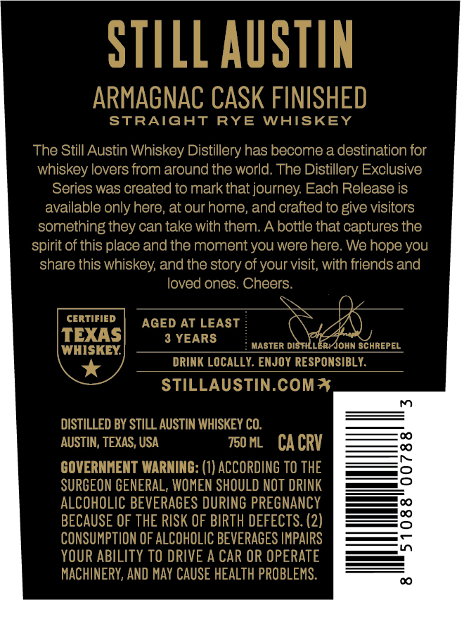
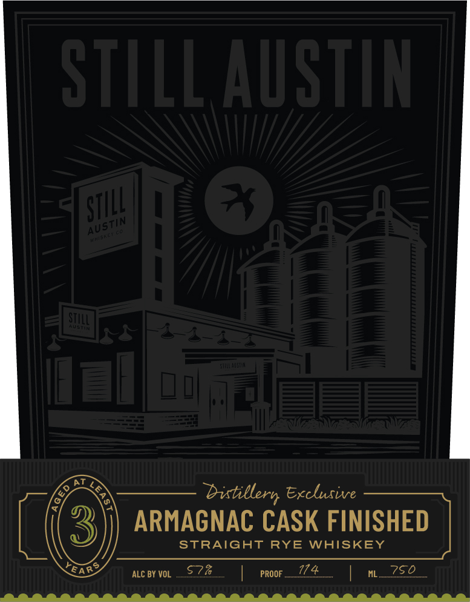

# TTB COLA Label Images - TTBID 26051001000646

**Brand Name:** STILL AUSTIN

**Fanciful Name:** DISTILLERY EXCLUSIVE

**Issue Date:** 02/23/2026

**Origin Code:** 44

**Product Class/Type:** 102

**Source:** [TTB Public COLA Registry](https://ttbonline.gov/colasonline/viewColaDetails.do?action=publicFormDisplay&ttbid=26051001000646)

## Label Images

### Back Label

### Front Label

### Label 3

## Extracted Label Text

*Text extracted via OCR - may contain errors*

*1 image(s) excluded: text did not meet readability threshold*

### Back Label

STRAIGHT RYE WHISKEY
The Still Austin Whiskey Distillery has become a destination for
whiskey lovers from around the world. The Distillery Exclusive
Series was created to mark that journey. Each Release is
available only here, at our home, and crafted to give visitors
something they can take with them. A bottle that captures the
spirit of this place and the moment you were here. We hope you
share this whiskey, and the story of your visit, with friends and
loved ones. Cheers
aN Qy
[| cerviFiep a 7 +S PN
CERTIFIED | AGED AT LEAST \ Z\)
|\TE) AS| 3 YEARS ( \heanadd
[wHisKey,| E MASTER DISFHLLER:4OHN SCHREPEL
Lge ate 3 DIN 7A1 19. EN GRY WESETINGIALY.
\. te 7 —_BRINICLOCALLY. ENJOY RESPONSIBLY.
Sse” “areas faeth MIS LDSE
STILLAUSTIN.COM*%
»
DISTILLED BY STILL AUSTIN WHISKEY CO. ——<—<=
AUSTIN, TEXAS, USA Tome CACRY —4
KAuE HNC? WIDMER —e
GOVERNME A G:(1) ACCORDING TO THE —tey
SURGEON GENERAL, WOMEN SHOULD NOT DRINK Jeg
ALCOHOLIC BEVERAGES DURING PREGNANCY ##————fe
BECAUSE OF THE RISK OF BIRTH DEFECTS. (2) <==
A ——
ae ——
MACHINERY, AND MAY CAUSE HEALTH PROBLEMS. iets

### Front Label

Le

distillery, Exclusive

ARMAGNAC CASK FINISHED

STRAIGHT RYE WHISKEY

EAS

acevo, $.7%

| proor....774

| 252
