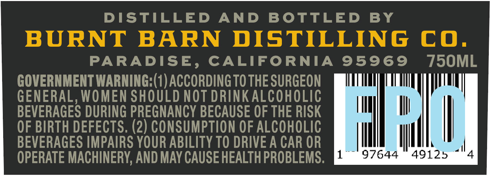
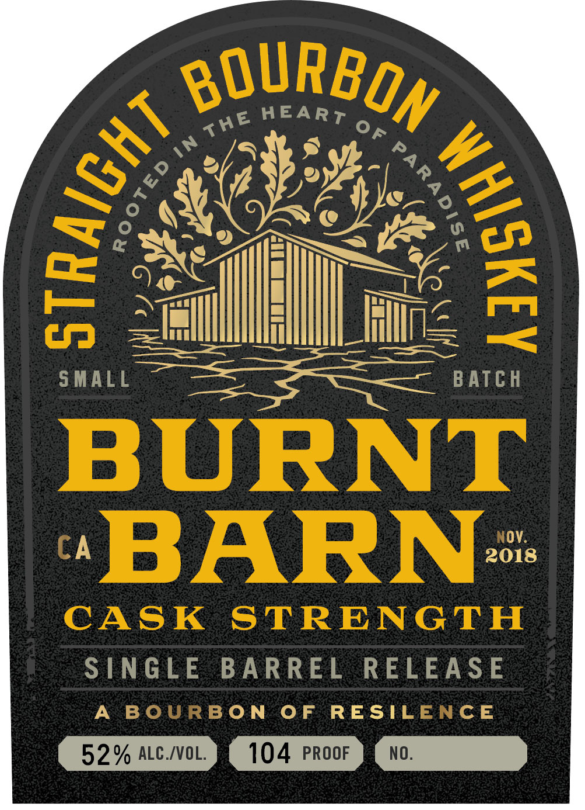
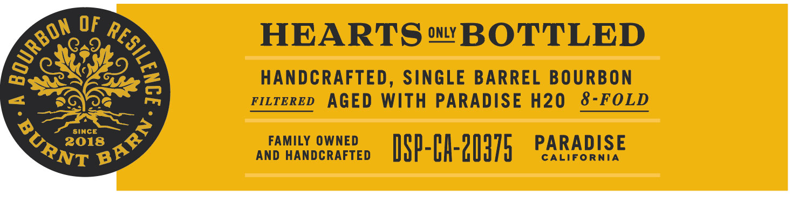

# TTB COLA Label Images - TTBID 26051001000647

**Brand Name:** BURNT BARN

**Issue Date:** 02/23/2026

**Origin Code:** 01

**Product Class/Type:** 101

**Source:** [TTB Public COLA Registry](https://ttbonline.gov/colasonline/viewColaDetails.do?action=publicFormDisplay&ttbid=26051001000647)

## Label Images

### Back Label

### Front Label

### Label 3

## Extracted Label Text

*Text extracted via OCR - may contain errors*

### Back Label

DISTILLED AND BOTTLED BY

PARADISE, CALIFORNIA 95969 750ML

GOVERNMENT WARNING: (1) ACCORDING TO THE SURGEON

GENERAL, WOMEN SHOULD NOT DRINK ALCOHOLIC

ll

ll

BEVERAGES DURING PREGNANCY BECAUSE OF THE RISK

OF BIRTH DEFECTS. (2) CONSUMPTION OF ALCOHOLIC

|

BEVERAGES IMPAIRS YOUR ABILITY TO DRIVE A CAR OR

1

{I

97644 49125

It

OPERATE MACHINERY, AND MAY CAUSE HEALTH PROBLEMS

### Front Label

A chasse oes

Gas

ln

|

Hi

Te

ss

Cr

al

Wu

|

li

ill

HL

iin ie

Gas st

EEN eer

SMALL

Sa ag — BATCH

Ov.

2018

SINGLE BARREL RELEASE

3ON OF RESIL

CE

GD > Ca

### Label 3

HEARTS™ BOTTLED

Ric

HANDCRAFTED, SINGLE BARREL BOURBON

=

ee

ritereD AGED WITH PARADISE H20 8-FOLD

SINCE

FAMILY OWNED

PARADISE

us 2018

RS

AND HANDCRAFTED

DSP-h-20d7

CALIFORNIA
