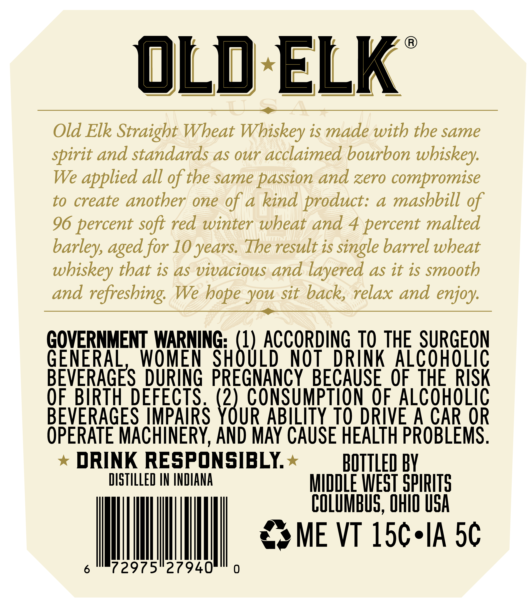
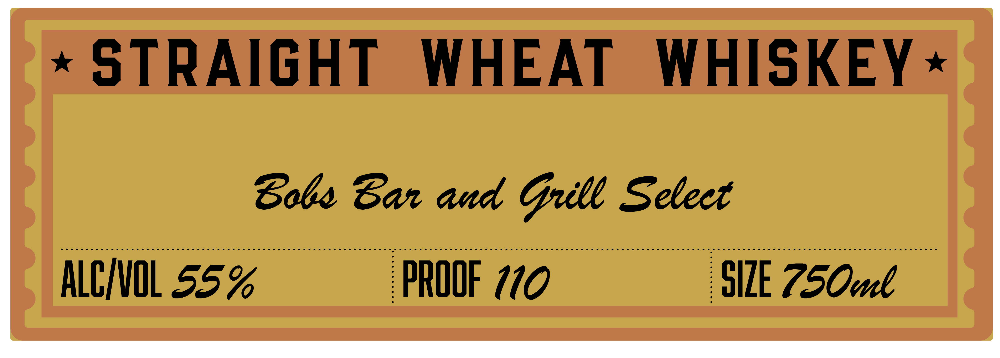

# TTB COLA Label Images - TTBID 26052001000101

**Brand Name:** OLD ELK

**Issue Date:** 02/23/2026

**Origin Code:** 09

**Product Class/Type:** 109

**Source:** [TTB Public COLA Registry](https://ttbonline.gov/colasonline/viewColaDetails.do?action=publicFormDisplay&ttbid=26052001000101)

## Label Images

### Back Label

### Front Label

### Label 4

## Extracted Label Text

*Text extracted via OCR - may contain errors*

*1 image(s) excluded: text did not meet readability threshold*

### Back Label

®)
OLD ELK
— eS
Old Elk Straight Wheat Whiskey is made with the same
spirit and standards as our acclaimed bourbon whiskey.
We applied all of the same passion and zero compromise
to create another one of a kind product: a mashbill of
96 percent soft red winter wheat and 4 percent malted
barley, aged for 10 years. The result is single barrel wheat
whiskey that is as vivacious and layered as it is smooth
and refreshing. We hope you sit back, relax and enjoy.
GOVERNMENT WARNING: ‘i ACCORDING T0 THE SURGEON
GENERAL, WOMEN SHOULD NOT DRINK ALCOHOLIC
BEVERAGES DURING PREGNANCY BECAUSE OF THE RISK
OF BIRTH DEFECTS. \" CONSUMPTION OF ALCOHOLIC
BEVERAGES IMPAIRS YOUR ABILITY TO DRIVE A CAR OR
OPERATE MACHINERY, AND MAY CAUSE HEALTH PROBLEMS.
* DRINK RESPONSIBLY.* — BOTTLED BY
DISTILLED IN INDIANA MINDLE WEST SPIRITS
COLUMBUS, OnId USA
MINN MME ve tse se
6° (2975 27940" 0

### Front Label

«STRAIGHT WHEAT WHISKEY «

Sobs Bar aud Gull Select

p9GEDDGFODFOGID ONGOING OOAGOOIOOSGIO ONO SONI OOGOOOIONOIGOOOIO ONGC OOI OOO GOOPOOAIFHOOIADODGOFNOOONOIHOND OO OID OBO ODIO OAS OOIOONON IHD OSDAOBIGO GAS ONDIO ONO OO HIS9059N09000009090099009909905990000909909909090590009

ILE 750cul

ALCVOL 55°%

PROOF 770
