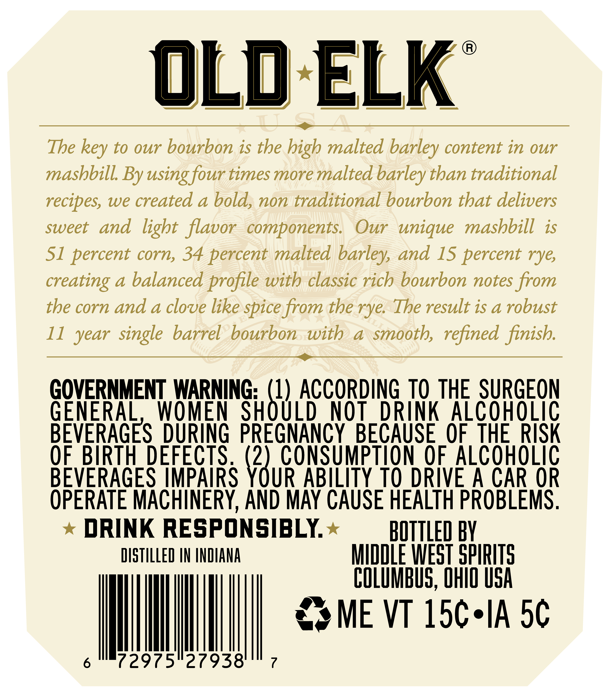
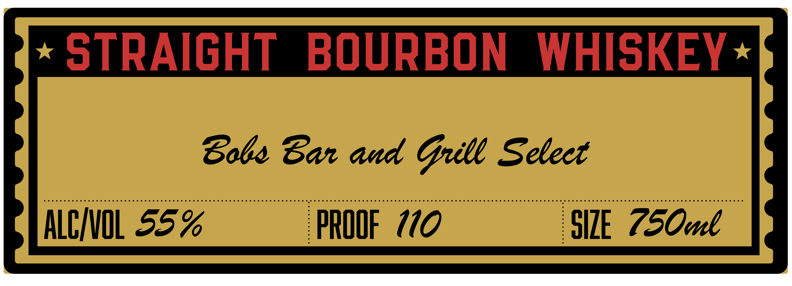

# TTB COLA Label Images - TTBID 26052001000105

**Brand Name:** OLD ELK

**Issue Date:** 02/27/2026

**Origin Code:** 09

**Product Class/Type:** 101

**Source:** [TTB Public COLA Registry](https://ttbonline.gov/colasonline/viewColaDetails.do?action=publicFormDisplay&ttbid=26052001000105)

## Label Images

### Back Label

### Front Label

### Label 4

## Extracted Label Text

*Text extracted via OCR - may contain errors*

*2 image(s) excluded: text did not meet readability threshold*

**Detected Age:** 11 Years

### Back Label

®)
OLD-ELK
— as
The key to our bourbon is the high malted barley content in our
mashbill. By using four times more malted barley than traditional
recipes, we created a bold, non traditional bourbon that delivers
sweet and light flavor components. Our unique mashbill is
51 percent corn, 34 percent malted barley, and 15 percent rye,
creating a balanced profile with classic rich bourbon notes from
the corn and a clove like spice from the rye. The result is a robust
11 year single barrel bourbon with a smooth, refined finish.
GOVERNMENT WARNING: ‘i ACCORDING TO THE SURGEON
GENERAL, WOMEN SHOULD NOT DRINK ALCOHOLIC
BEVERAGES DURING PREGNANCY BECAUSE OF THE RISK
OF BIRTH DEFECTS. \" CONSUMPTION OF ALCOHOLIC
BEVERAGES IMPAIRS YOUR ABILITY TO DRIVE A CAR OR
OPERATE MACHINERY, AND MAY CAUSE HEALTH PROBLEMS.
* DRINK RESPONSIBLY.* — BOTTLED BY
DISTILLED IN INDIANA MIDDLE WEST SPIRITS
COLUMBUS, OnI0 USA
6° (297527938 7
