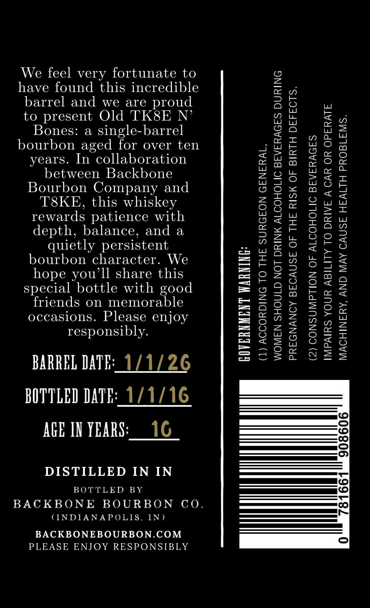
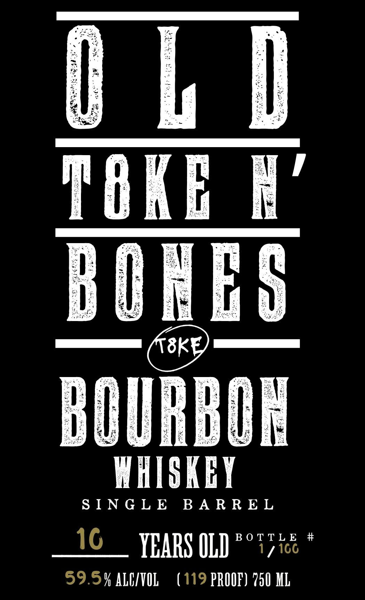

# TTB COLA Label Images - TTBID 26052001000143

**Brand Name:** OLD T8KEN' BONES

**Issue Date:** 03/12/2026

**Origin Code:** 19

**Product Class/Type:** 141

**Source:** [TTB Public COLA Registry](https://ttbonline.gov/colasonline/viewColaDetails.do?action=publicFormDisplay&ttbid=26052001000143)

## Label Images

### Back Label

### Front Label

## Extracted Label Text

*Text extracted via OCR - may contain errors*

**Detected Proof:** 119

### Back Label

We feel very fortunate to
have found this incredible
barrel and we are proud
to present Old TK8E N’
Bones: a single-barrel
bourbon aged for over ten
years. In collaboration
between Backbone
Bourbon Company and
T8KE, this whiskey
rewards patience with
depth, balance, and a
quietly persistent
bourbon character. We
hope you'll share this
special bottle with good
friends on memorable
occasions. Please enjoy
responsibly.

BARREL DATE:_1/1/26
BOTTLED DATE: 1/1/16
AGE IN YEARS:__ 16

DISTILLED IN IN

BOTTLED BY

BACKBONE BOURBON CO.

(INDIANAPOLIS, IN)

BACKBONEBOURBON.COM
PLEASE ENJOY RESPONSIBLY

GOVERNMENT WARNING:

(1) ACCORDING TO THE SURGEON GENERAL,

WOMEN SHOULD NOT DRINK ALCOHOLIC BEVERAGES DURING
PREGNANCY BECAUSE OF THE RISK OF BIRTH DEFECTS.
(2) CONSUMPTION OF ALCOHOLIC BEVERAGES

IMPAIRS YOUR ABILITY TO DRIVE A CAR OR OPERATE
MACHINERY, AND MAY CAUSE HEALTH PROBLEMS.

)
(—)
©
00)
[=]
o
—
[te
(te)
|
©)
iN

0

### Front Label

sk

TOKE

URE

WHISKEY

SINGLE BARREL

1G __ YEARS OLD

BOTTLE #

/ \GG

59.5% ALG/VOL (119 PROOF) 750 ML
