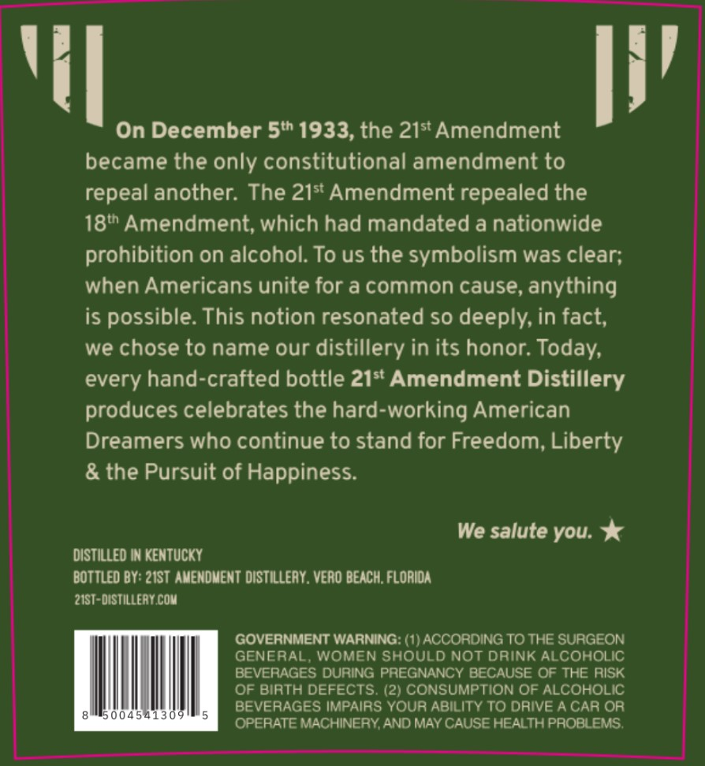
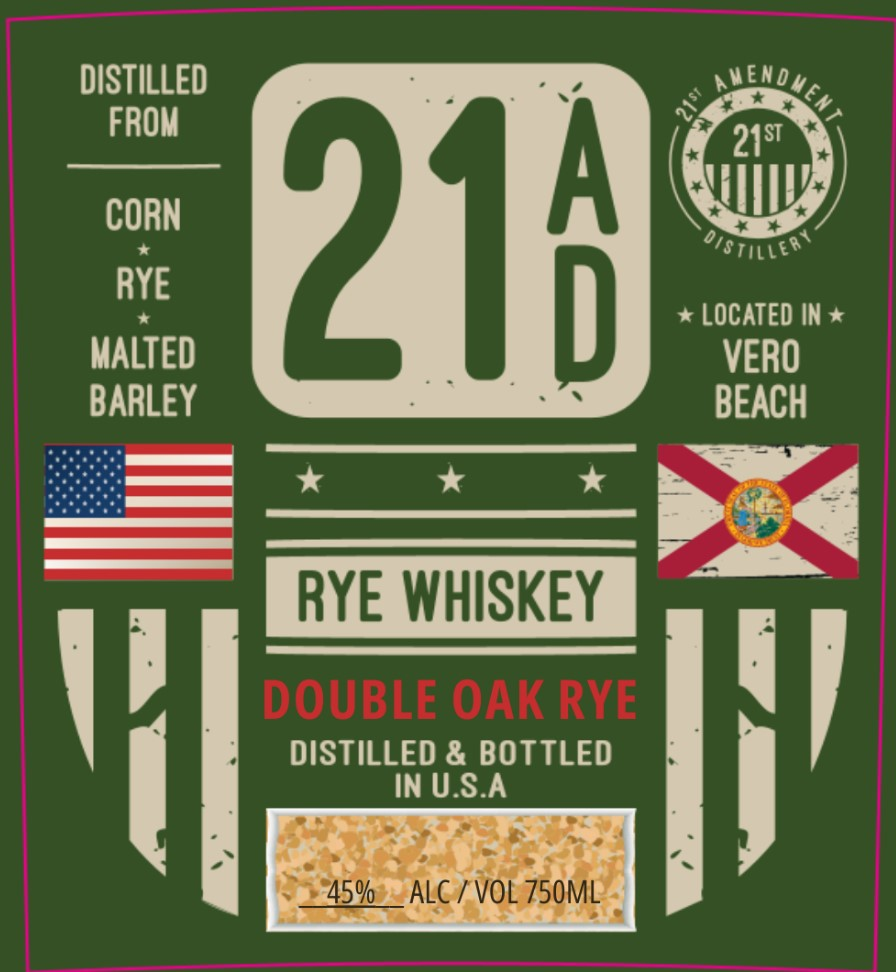

# TTB COLA Label Images - TTBID 26053001000021

**Brand Name:** 21AD

**Fanciful Name:** DOUBLE OAK RYE

**Issue Date:** 02/23/2026

**Origin Code:** 16

**Product Class/Type:** 142

**Source:** [TTB Public COLA Registry](https://ttbonline.gov/colasonline/viewColaDetails.do?action=publicFormDisplay&ttbid=26053001000021)

## Label Images

### Back Label

### Front Label

## Extracted Label Text

*Text extracted via OCR - may contain errors*

### Back Label

i!

‘il

On December 5" 1933, the 21* Amendment

became the only constitutional amendment to

repeal another. The 21* Amendment repealed the

18" Amendment, which had mandated a nationwide

prohibition on alcohol. To us the symbolism was clear;

when Americans unite for a common cause, anything

is possible. This notion resonated so deeply, in fact,

we chose to name our distillery in its honor. Today,

every hand-crafted bottle 21* Amendment Distillery

produces celebrates the hard-working American

Dreamers who continue to stand for Freedom, Liberty

& the Pursuit of Happiness.

We salute you.

DISTILLED IN KENTUCKY

BOTTLED BY: 21ST AMENDMENT DISTILLERY. VERO BEACH, FLORIDA

21ST-DISTILLERY.COM

GENERAL, WOMEN SHOULD NOT DRINK ALCOHOLIC

GOVERNMENT WARNING: (1) ACCORDING TO THE SURGEON

BEVERAGES DURING PREGNANCY BECAUSE OF THE RISK

OF BIRTH DEFECTS. (2) CONSUMPTION OF ALCOHOLIC

BEVERAGES IMPAIRS YOUR ABILITY TO DRIVE A CAR OR

hhh

OPERATE MACHINERY, AND MAY CAUSE HEALTH PROBLEMS.

### Front Label

DISTILLED
FROM

aS oe ‘a
CORN
RYE
* * LOCATED IN *
MALTED VERO
BARLEY BEACH

DISTILLED & BOTTLED ]
IN U.S.A

pk ge 24
