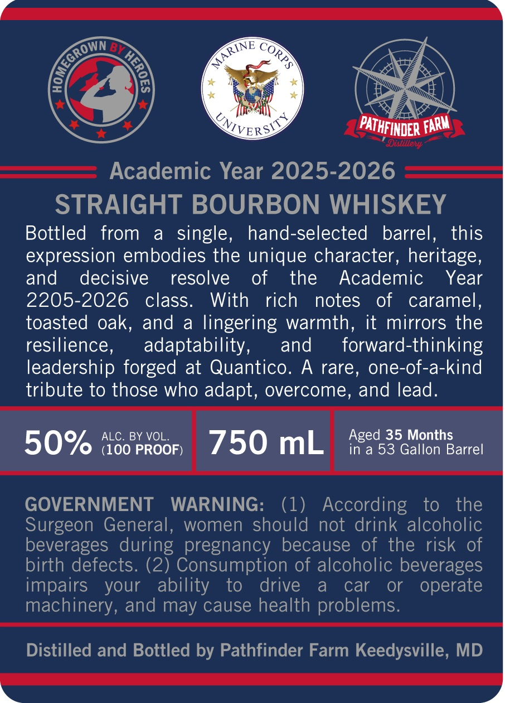
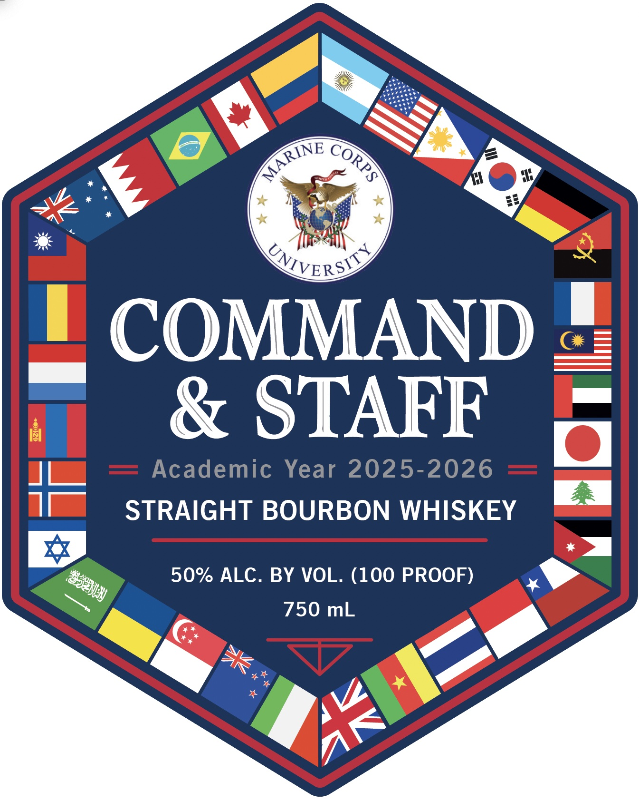

# TTB COLA Label Images - TTBID 26053001000040

**Brand Name:** COMMAND & STAFF

**Issue Date:** 03/09/2026

**Origin Code:** 25

**Product Class/Type:** 101

**Source:** [TTB Public COLA Registry](https://ttbonline.gov/colasonline/viewColaDetails.do?action=publicFormDisplay&ttbid=26053001000040)

## Label Images

### Back Label

### Front Label

## Extracted Label Text

*Text extracted via OCR - may contain errors*

**Detected Proof:** 100

### Back Label

cS

\NE

Re

Row <2

xo

4:

4S

hor

iS 4

ms

ie

ER

a”

=A

Academic Year 2025-2026

STRAIGHT BOURBON WHISKEY

Bottled from a single, hand-selected barrel

this

expression embodies the unique character, heritage

and decisive

resolve of

the Academic Year

2205-2026 class

With

rich notes of caramel

toasted oak, and a lingering warmth

it mirrors the

resilience

adaptability,

and

forward-thinking

leadership forged at Quantico. A rare, one-of-a-kind

tribute to those who adapt, overcome, and lead.

ALC. BY VOL

50%

(100 PROOF)

GOVERNMENT WARNING:

According to the

Surgeon General, women ened not drink alcoholic

beverages during pregnancy because of the risk of

birth defects. (2) Consumption of alcoholic beverages

impairs your

ability to drive a car or

operate

machinery, and may cause health problems

Distilled and Bottled by Pathfinder Farm Keedysville, MD

### Front Label

(VVERSI D
COMMAND
& STAFF
Academic Year 2025-2026
STRAIGHT BOURBON WHISKEY
50% ALC. BY VOL. (100 PROOF)
750 mL
MARINE
CORPS
~#z83
