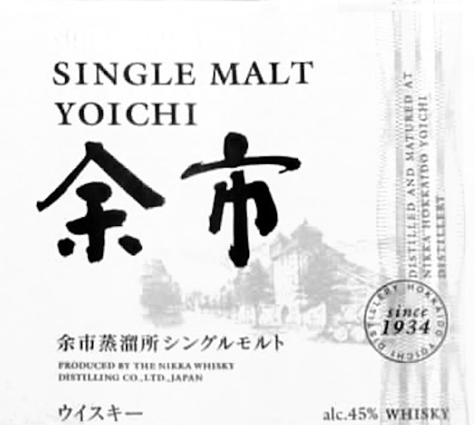
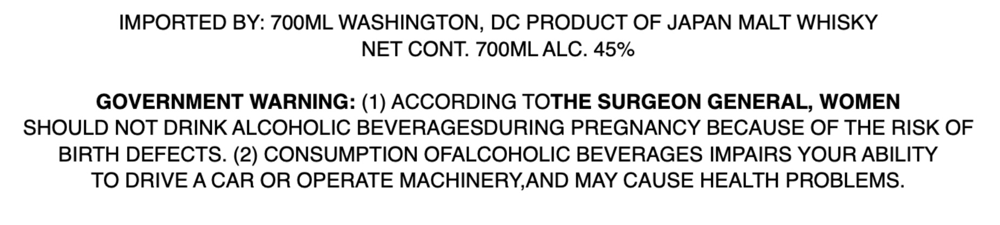

# TTB COLA Label Images - TTBID 26053001000113

**Brand Name:** YOICHI

**Issue Date:** 03/02/2026

**Origin Code:** 59

**Product Class/Type:** 118

**Source:** [TTB Public COLA Registry](https://ttbonline.gov/colasonline/viewColaDetails.do?action=publicFormDisplay&ttbid=26053001000113)

## Label Images

### Label 1

### Label 2

## Extracted Label Text

*Text extracted via OCR - may contain errors*

### Label 1

SINGLE MALT
YOICHI 33

Jr i>

ss BS =<
i)

Si RM A Eh Cy
pet Sho

FRODUCED BT THT MIRKA WHIAAT
DIETILIING OO LTD JAPAN

WAAyL— alc.45% WHISKY

### Label 2

IMPORTED BY: 700ML WASHINGTON, DC PRODUCT OF JAPAN MALT WHISKY

NET CONT. 700ML ALC. 45%

GOVERNMENT WARNING: (1) ACCORDING TOTHE SURGEON GENERAL, WOMEN

SHOULD NOT DRINK ALCOHOLIC BEVERAGESDURING PREGNANCY BECAUSE OF THE RISK OF

BIRTH DEFECTS. (2) CONSUMPTION OFALCOHOLIC BEVERAGES IMPAIRS YOUR ABILITY

TO DRIVE A CAR OR OPERATE MACHINERY,AND MAY CAUSE HEALTH PROBLEMS.
