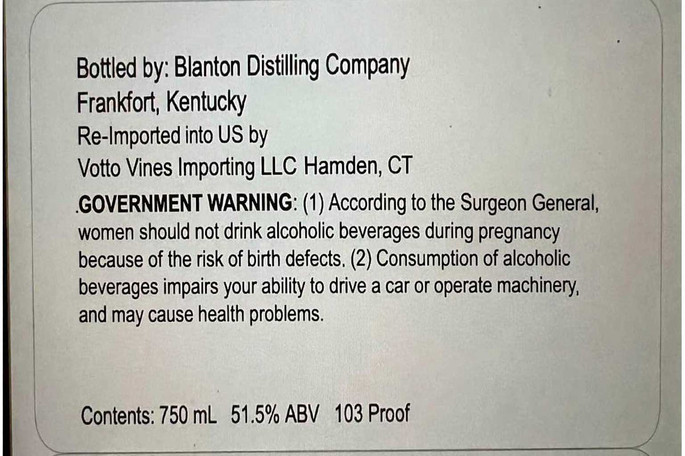
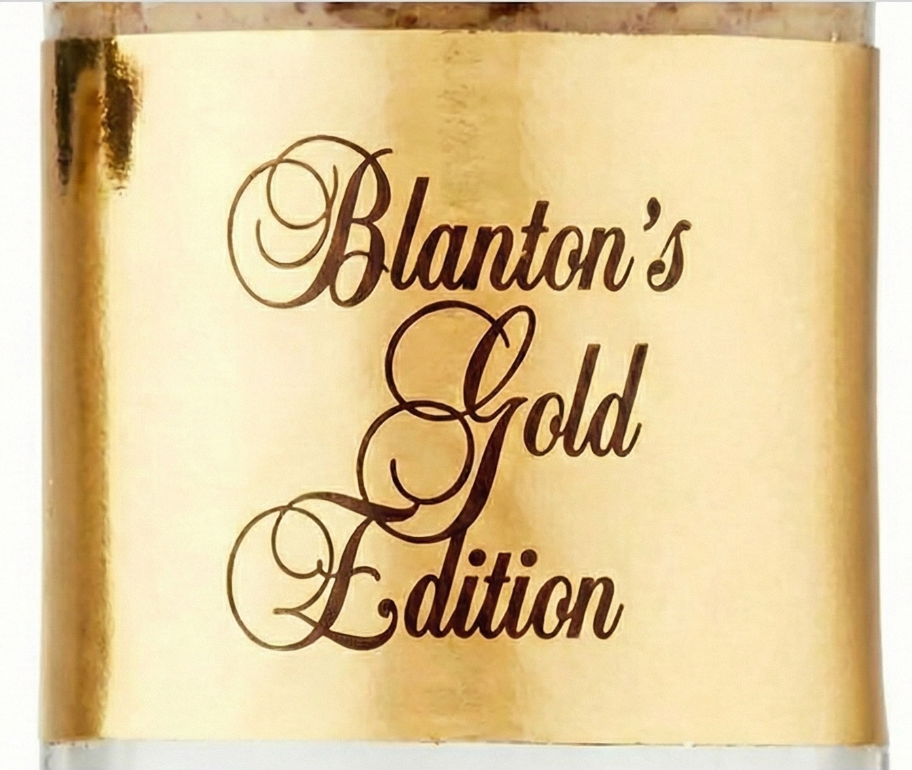

# TTB COLA Label Images - TTBID 26054001000205

**Brand Name:** BLANTON'S

**Fanciful Name:** GOLD EDITION

**Issue Date:** 02/23/2026

**Origin Code:** 22

**Product Class/Type:** 101

**Source:** [TTB Public COLA Registry](https://ttbonline.gov/colasonline/viewColaDetails.do?action=publicFormDisplay&ttbid=26054001000205)

## Label Images

### Back Label

### Front Label

### Label 3

## Extracted Label Text

*Text extracted via OCR - may contain errors*

*1 image(s) excluded: text did not meet readability threshold*

### Back Label

Bottled by: Blanton Distilling Company

Frankfort, Kentucky

Re-Imported into US by

Votto Vines Importing LLC Hamden, CT

GOVERNMENT WARNING: (1) According to the Surgeon General,

women should not drink alcoholic beverages during pregnancy

because of the risk of birth defects, (2) Consumption of alcoholic

beverages impairs your ability to drive a car or operate machinery,

and may cause health problems.

Contents: 750 mL 51.5% ABV 103 Proof

### Front Label

: sl art:

26 from Baw

in farchouse # on lek Ne 40

ila flere bot

nat 103

Mee

SIRAIGHT BOURBON WHISKEY

51%4% ALC./VOL
