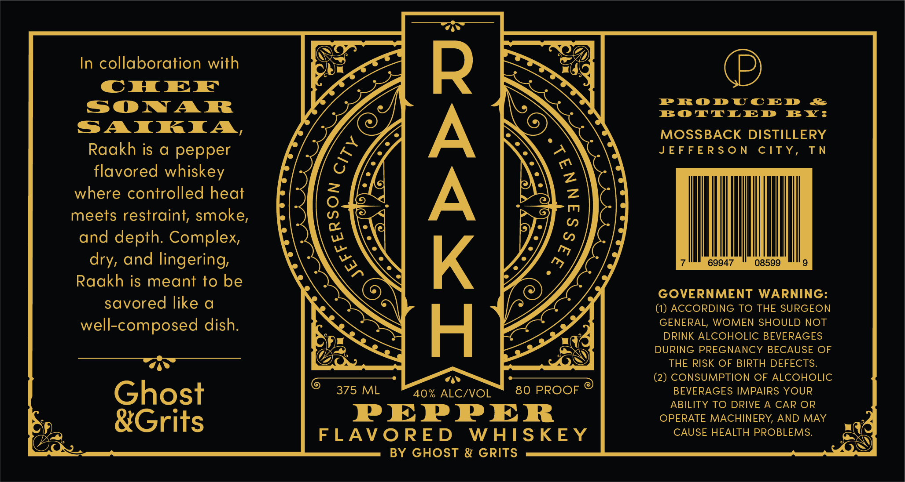

# TTB COLA Label Images - TTBID 26054001000269

**Brand Name:** RAAKH

**Issue Date:** 02/26/2026

**Origin Code:** 43

**Product Class/Type:** 149

**Source:** [TTB Public COLA Registry](https://ttbonline.gov/colasonline/viewColaDetails.do?action=publicFormDisplay&ttbid=26054001000269)

## Label Images

### Label 1

## Extracted Label Text

*Text extracted via OCR - may contain errors*

**Detected Proof:** 80

### Label 1

In collaboration with

S

D)

CHEE

Somw A Fk

RPROPYDUCED &

BOTTLED BY:

SAITKRIAIA,

MOSSBACK DISTILLERY

Raakh is a pepper

JEFFERSON CITY, TN

flavored whiskey

where controlled heat

meets restraint, smoke,

and depth. Complex,

dry, and lingering,

9947

0859:

Raakh is meant to be

savored like a

GOVERNMENT WARNING:

(1) ACCORDING TO THE SURGEON

well-composed dish.

GENERAL, WOMEN SHOULD NOT

DRINK ALCOHOLIC BEVERAGES

DURING PREGNANCY BECAUSE OF

as

G@

SN)

THE RISK OF BIRTH DEFECTS.

(2) CONSUMPTION OF ALCOHOLIC

C 375 ML

40% ALC/VOL

80 PROOF ®

BEVERAGES IMPAIRS YOUR

Ghost

ABILITY TO DRIVE A CAR OR

PEPPER

OPERATE MACHINERY, AND MAY

&Grits

FLAVORED WHISKEY

CAUSE HEALTH PROBLEMS.

G

SS)

BY GHOST & GRITS
