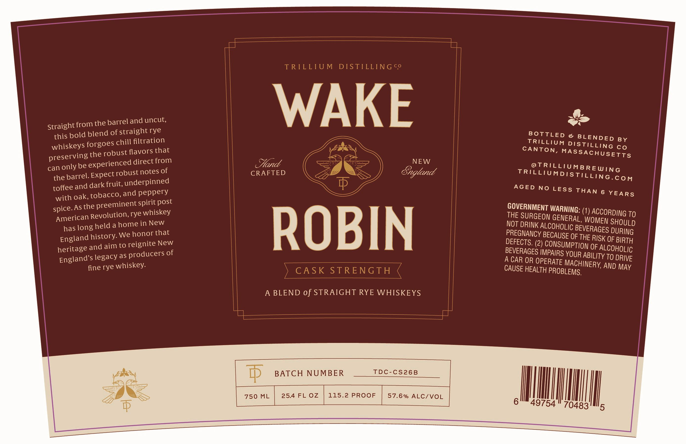

# TTB COLA Label Images - TTBID 26054001000307

**Brand Name:** TRILLIUM DISTILLING CO

**Issue Date:** 02/24/2026

**Origin Code:** 26

**Product Class/Type:** 122

**Source:** [TTB Public COLA Registry](https://ttbonline.gov/colasonline/viewColaDetails.do?action=publicFormDisplay&ttbid=26054001000307)

## Label Images

### Label 1

## Extracted Label Text

*Text extracted via OCR - may contain errors*

### Label 1

—$_$_.

—$_$_

eee

A.

ncut,

e>

Straight from the barrel andu

this bold

blend of straight rye

WAKE |

BOTTLEDs BLENDED BY

whiskeys forgoes chill

filtration

TRILLIUM DISTILLING co

CANTON, MASSACHUSETTS

preserv

ing the robust flavors that

=

NEW

can only be experien

ced direct from

Head

@TRILLIUMBREWING

pust notes of

CRAFTED

Stagland

the

barrel. EXPeCtT©

TRILEIMMDISTILLING. con

toffee and dark f

ait underpinned

}

ery

AGED NO LESS THAN 6 YEARS

with oak, tobacco, and pepp

spice. As the

preeminent spirit post

GOVERNMENT WARNING:

American Revolution, rye

whiskey

(1) ACCORDING To

THE SURGEON GENERAL,

OMEN SHOULD

has lon

gheld a home in|\New

NOT DRINK ALCOHOLIC BEVE

RAGES DURING

England history. W

e honor that

PREGNANCY BECAUSE OF TH

E RISK OF BIRTH

DEFECTS. (2) CONSUMPTIO,

herita

ge andaim to reignite New

BEVERAGES IMPAIRS YOUR

N OF ALCOHOLIC

England's legac

y as producers of

ROB

IN

=

ABILITY TO DRIVE

fine rye whiskey.

A CAR OR OPERATE MACH

INERY, AND MAY

CAUSE HEALTH PROBLEMS,

A BLEND of STRAIGHT RYE WHISKEYS

|

CH NUMBER

TDC

CS26B

57.6% ALC/VOL

aL
