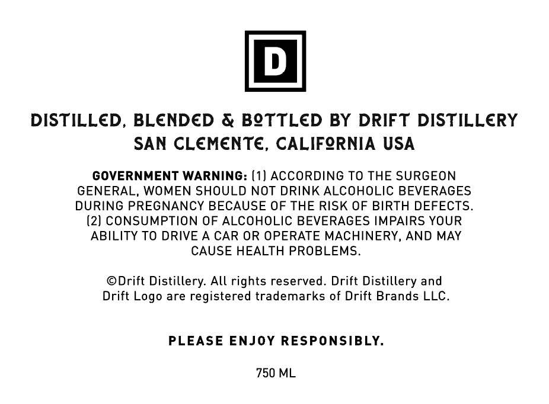
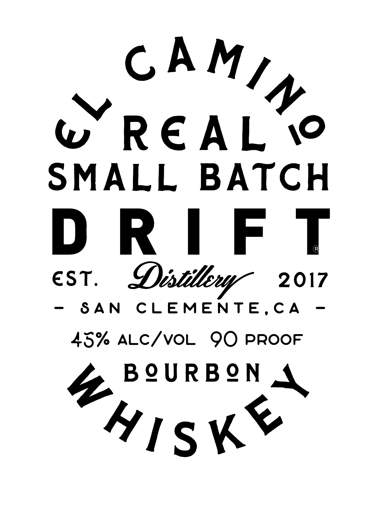

# TTB COLA Label Images - TTBID 26054001000342

**Brand Name:** DRIFT

**Fanciful Name:** EL CAMINO REAL SMALL BATCH BOURBON

**Issue Date:** 02/27/2026

**Origin Code:** 01

**Product Class/Type:** 141

**Source:** [TTB Public COLA Registry](https://ttbonline.gov/colasonline/viewColaDetails.do?action=publicFormDisplay&ttbid=26054001000342)

## Label Images

### Back Label

### Label 1

## Extracted Label Text

*Text extracted via OCR - may contain errors*

**Detected Proof:** 90

### Back Label

DISTILLED, BLENDED & BOTTLED BY DRIFT DISTILLERY

SAN CLEMENTE, CALIFORNIA USA

GOVERNMENT WARNING: (1) ACCORDING TO THE SURGEON

GENERAL, WOMEN SHOULD NOT DRINK ALCOHOLIC BEVERAGES

DURING PREGNANCY BECAUSE OF THE RISK OF BIRTH DEFECTS.

(2) CONSUMPTION OF ALCOHOLIC BEVERAGES IMPAIRS YOUR

ABILITY TO DRIVE A CAR OR OPERATE MACHINERY, AND MAY

CAUSE HEALTH PROBLEMS.

©Drift Distillery. All rights reserved. Drift Distillery and

Drift Logo are registered trademarks of Drift Brands LLC.

PLEASE ENJOY RESPONSIBLY.

750 ML

### Label 1

CAM)

Vv

WwW REAL YO
SMALL BATCH
DRIFT
EST. Distillery 2017
45% ALC/VOL 9O PROOF
j& PoURBON A

4YIisKe
