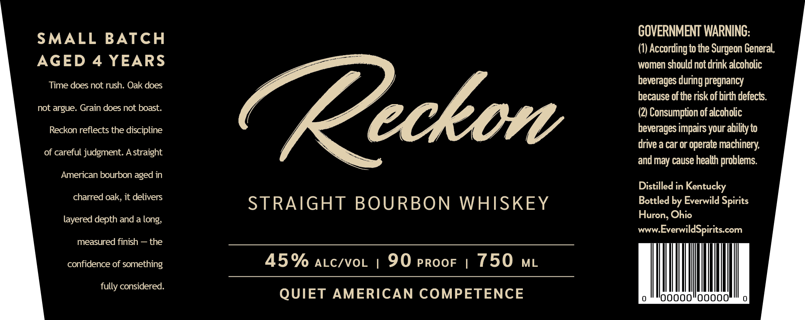

# TTB COLA Label Images - TTBID 26054001000608

**Brand Name:** RECKON

**Issue Date:** 03/03/2026

**Origin Code:** 09

**Product Class/Type:** 101

**Source:** [TTB Public COLA Registry](https://ttbonline.gov/colasonline/viewColaDetails.do?action=publicFormDisplay&ttbid=26054001000608)

## Label Images

### Label 1

## Extracted Label Text

*Text extracted via OCR - may contain errors*

**Detected Age:** 4 Years

### Label 1

GOVERNMENT WARNING:
SMALL BATCH (1) According to the Surgeon General,

AGED 4 YEARS women should not drink alcoholic
Time does not rush. Oak does beverages during pregnancy
because of the risk of birth defects.
not argue. Grain does not boast. (2) Consumption of alcoholic
Reckon reflects the discipline beverages impairs your ability to
drive a car or operate machinery,

of careful judgment. A straight ant may cause health problems.
American bourbon aged in
a Distilled in Kentucky
cred oak delves STRAIGHT BOURBON WHISKEY Bottled by Everwild Spirits
layered depth and a long, Huron, Ohio

www.EverwildSpirits.com

measured finish — the

confidence of something 45% atc/vor | 9O proor | 750 mt

a QUIET AMERICAN COMPETENCE
