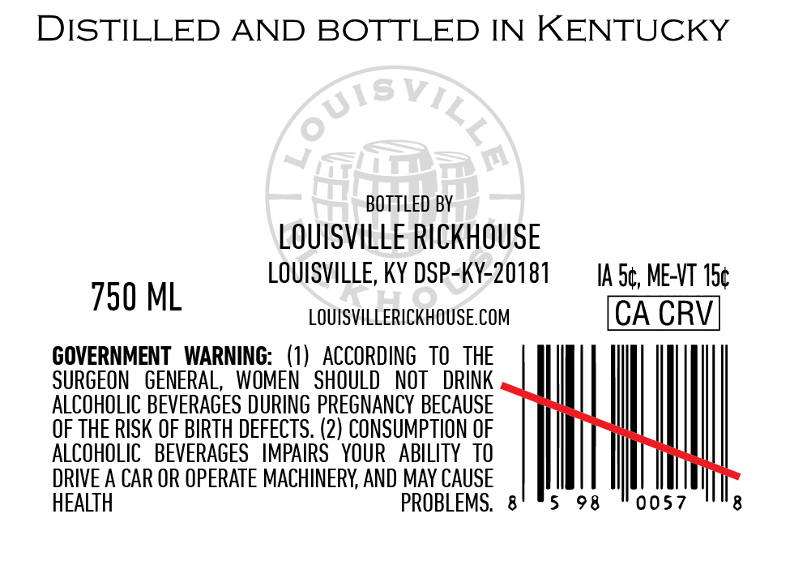
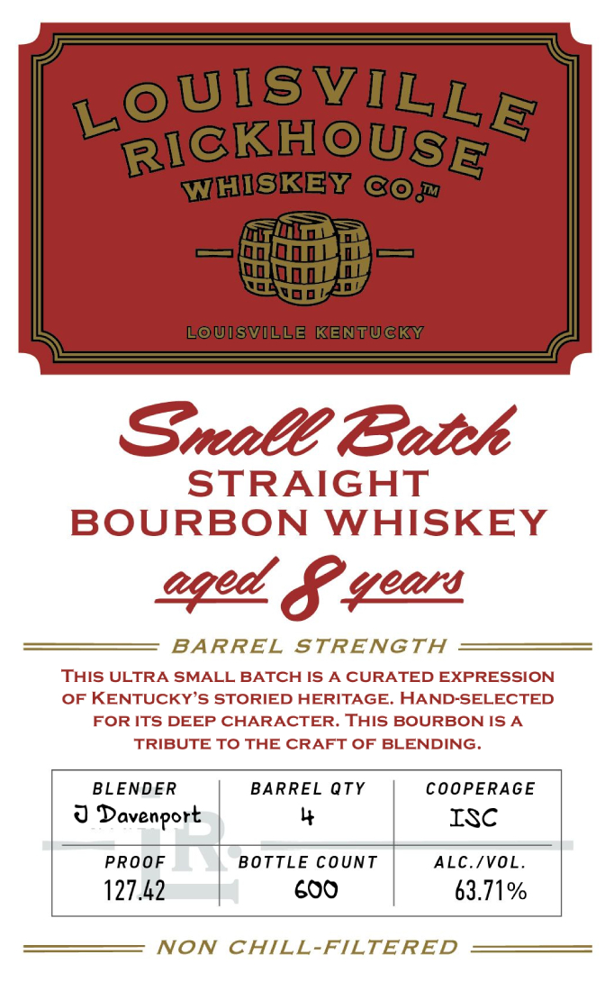

# TTB COLA Label Images - TTBID 26054001000650

**Brand Name:** LOUISVILLE RICKHOUSE WHISKEY CO

**Issue Date:** 02/24/2026

**Origin Code:** 22

**Product Class/Type:** 101

**Source:** [TTB Public COLA Registry](https://ttbonline.gov/colasonline/viewColaDetails.do?action=publicFormDisplay&ttbid=26054001000650)

## Label Images

### Back Label

### Front Label

## Extracted Label Text

*Text extracted via OCR - may contain errors*

### Back Label

DISTILLED AND BOTTLED IN KENTUCKY

BOTTLED BY

LOUISVILLE RICKHOUSE

LOUISVILLE, KY DSP-KY-20181

IA.S¢, ME-VT 15¢

750 ML

LOUISVILLERICKHOUSE.COM

CA CRV

GOVERNMENT WARNING: (1) ACCORDING TO THE

SURGEON GENERAL, WOMEN SHOULD NOT DRINK

ALCOHOLIC BEVERAGES DURING PREGNANCY BECAUSE

OF THE RISK OF BIRTH DEFECTS. (2) CONSUMPTION OF

ALCOHOLIC BEVERAGES IMPAIRS YOUR ABILITY TO

DRIVE A CAR OR OPERATE MACHINERY, AND MAY CAUSE

HE

BLEMS. 8

5 98

0057

8

### Front Label

Small Eateh

STRAIGHT

BOURBON WHISKEY

aged S. Geass

BARREL STRENGTH

THIS ULTRA SMALL BATCH IS A CURATED EXPRESSION

OF KENTUCKY’S STORIED HERITAGE. HAND-SELECTED

FOR ITS DEEP CHARACTER. THIS BOURBON IS A

TRIBUTE TO THE CRAFT OF BLENDING.

BLENDER

COOPERAGE

BARREL QTY

y

ISc

U Davenport

|

|

PROOF

BOTTLE COUNT

ALC./VOL.

127.42

|

600

63.71%

NON CHILL-FILTERED
