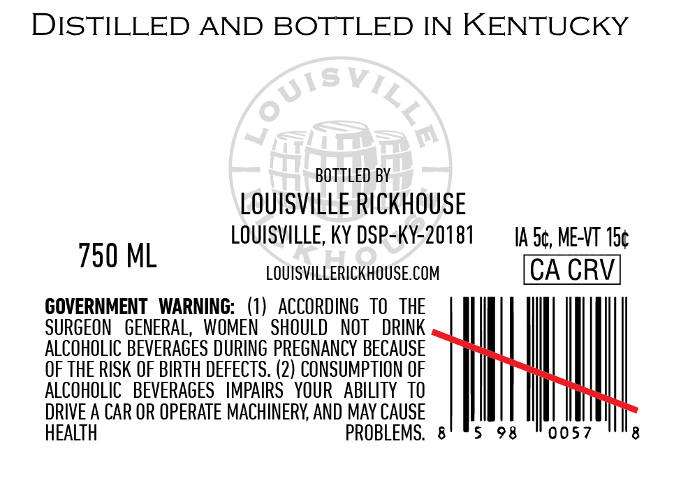
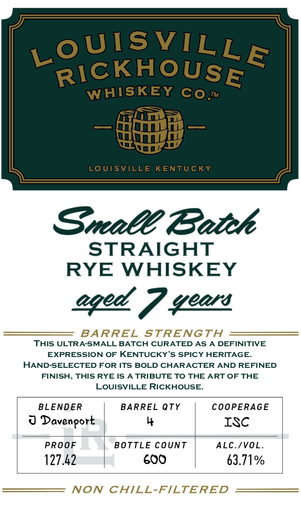

# TTB COLA Label Images - TTBID 26054001000652

**Brand Name:** LOUISVILLE RICKHOUSE WHISKEY CO

**Issue Date:** 02/25/2026

**Origin Code:** 22

**Product Class/Type:** 102

**Source:** [TTB Public COLA Registry](https://ttbonline.gov/colasonline/viewColaDetails.do?action=publicFormDisplay&ttbid=26054001000652)

## Label Images

### Back Label

### Front Label

## Extracted Label Text

*Text extracted via OCR - may contain errors*

**Detected Proof:** 127.4

### Back Label

DISTILLED AND BOTTLED IN KENTUCKY

BOTTLED BY
LOUISVILLE RICKHOUSE
LOUISVILLE, KY DSP-KY-20181

730 ML LOUISVILLERICKHOUSE.COM

GOVERNMENT WARNING: (1) ACCORDING TO THE
SURGEON GENERAL, WOMEN SHOULD NOT DRINK
ALCOHOLIC BEVERAGES DURING PREGNANCY BECAUSE
OF THE RISK OF BIRTH DEFECTS. (2) CONSUMPTION OF
ALCOHOLIC BEVERAGES IMPAIRS YOUR ABILITY TO
DRIVE A CAR OR OPERATE MACHINERY, AND MAY CAUSE
HEALTH PROBLEMS. 8

5

IA.S¢, ME-VT 15¢

98

CA CRV

0057

8

### Front Label

WIS EE

215

W HI

si

—

Trae rn

mois

Small Caitrh

STRAIGHT

RYE WHISKEY

Reef eeets

THIS ULTRA-SMALL BATCH CURATED AS A DEFINITIVE

AR REL

STRENGTH =

EXPRESSION OF KENTUCKY'S SPICY HERITAGE.

HAND-SELECTED FOR ITS BOLD CHARACTER AND REFINED

FINISH, THIS RYE IS A TRIBUTE TO THE ART OF THE

LOUISVILLE RICKHOUSE.

BLENDER

BARREL QTY

COOPERAGE

|

oY Davenport

y

ISC

|

|

PROOF

BOTTLE COUNT

ALC./VOL

127.42

|

600

63.71%

NON CHILL-FILTERED
