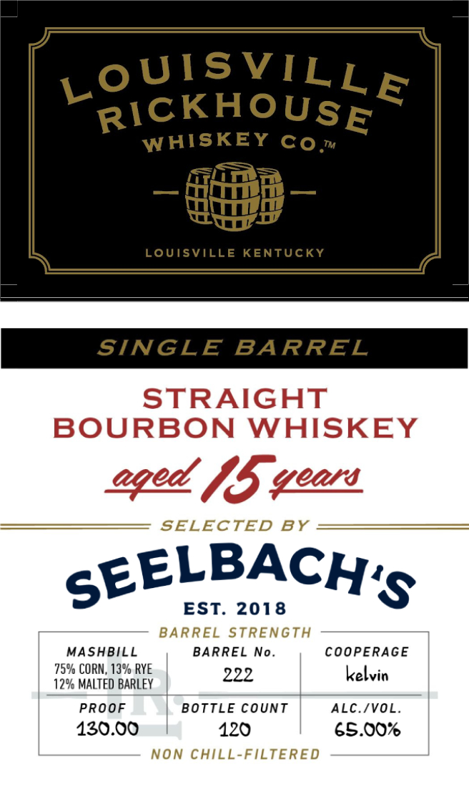

# TTB COLA Label Images - TTBID 26054001000654

**Brand Name:** LOUISVILLE RICKHOUSE WHISKEY CO

**Issue Date:** 02/24/2026

**Origin Code:** 22

**Product Class/Type:** 101

**Source:** [TTB Public COLA Registry](https://ttbonline.gov/colasonline/viewColaDetails.do?action=publicFormDisplay&ttbid=26054001000654)

## Label Images

### Back Label

### Front Label

## Extracted Label Text

*Text extracted via OCR - may contain errors*

### Back Label

DISTILLED AND BOTTLED IN KENTUCKY

BOTTLED BY

LOUISVILLE RICKHOUSE

LOUISVILLE, KY DSP-KY-20181

IA.S¢, ME-VT 15¢

750 ML

LOUISVILLERICKHOUSE.COM

CA CRV

GOVERNMENT WARNING: (1) ACCORDING TO THE

SURGEON GENERAL, WOMEN SHOULD NOT DRINK

ALCOHOLIC BEVERAGES DURING PREGNANCY BECAUSE

OF THE RISK OF BIRTH DEFECTS. (2) CONSUMPTION OF

ALCOHOLIC BEVERAGES IMPAIRS YOUR ABILITY TO

DRIVE A CAR OR OPERATE MACHINERY, AND MAY CAUSE

HE

BLEMS. 8

5 98

0057

8

### Front Label

S

L

OoUISVIL

1\CKHOUS

ne

WHISKEY Co,

iT?

—

wee

Coy

LBACH

sEE

Ss

EST. 2018

MASHBILL

BARREL No!

COOPERAGE

75% CORN, 13% RYE

222

kelvin

2% MALTED BARLEY |

PROOF

BOTTLE COUNT

ALC./VOL.

130.00

120

65.00%
