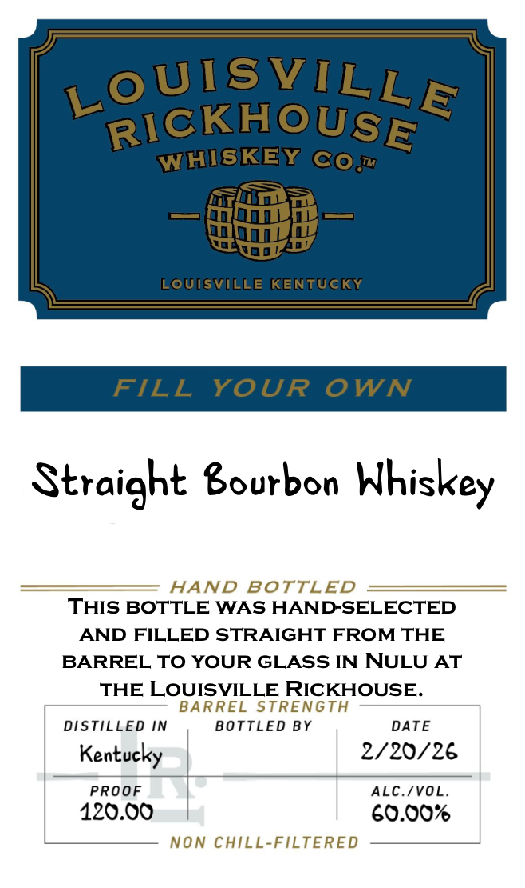

# TTB COLA Label Images - TTBID 26054001000664

**Brand Name:** LOUISVILLE RICKHOUSE WHISKEY CO

**Issue Date:** 03/03/2026

**Origin Code:** 22

**Product Class/Type:** 101

**Source:** [TTB Public COLA Registry](https://ttbonline.gov/colasonline/viewColaDetails.do?action=publicFormDisplay&ttbid=26054001000664)

## Label Images

### Back Label

### Label 1

## Extracted Label Text

*Text extracted via OCR - may contain errors*

### Back Label

DISTILLED AND BOTTLED IN KENTUCKY

BOTTLED BY
LOUISVILLE RICKHOUSE
LOUISVILLE, KY DSP-KY-20181

730 ML LOUISVILLERICKHOUSE.COM

GOVERNMENT WARNING: (1) ACCORDING TO THE
SURGEON GENERAL, WOMEN SHOULD NOT DRINK
ALCOHOLIC BEVERAGES DURING PREGNANCY BECAUSE
OF THE RISK OF BIRTH DEFECTS. (2) CONSUMPTION OF
ALCOHOLIC BEVERAGES IMPAIRS YOUR ABILITY TO
DRIVE A CAR OR OPERATE MACHINERY, AND MAY CAUSE
HEALTH PROBLEMS. 8

5

IA.S¢, ME-VT 15¢

98

CA CRV

0057

8

### Label 1

LOUISVILE ,
Ri GCKHOUS E
WIHISIKENY (Co
Tira
— foto ra —
Straight Bourbon Whiskey
ass HAND SOTTLED —
THIS BOTTLE WAS HAND-SELECTED
AND FILLED STRAIGHT FROM THE
BARREL TO YOUR GLASS IN NULU AT
THE LOUISVILLE RICKHOUSE.
DISTILLED IN "BOTTLED BY. DATE

Kentucky 2/20/26
PROOF aU ALC./VOL.

420.00 | 60.00%
U—___ NON CHILL-FILTERED
