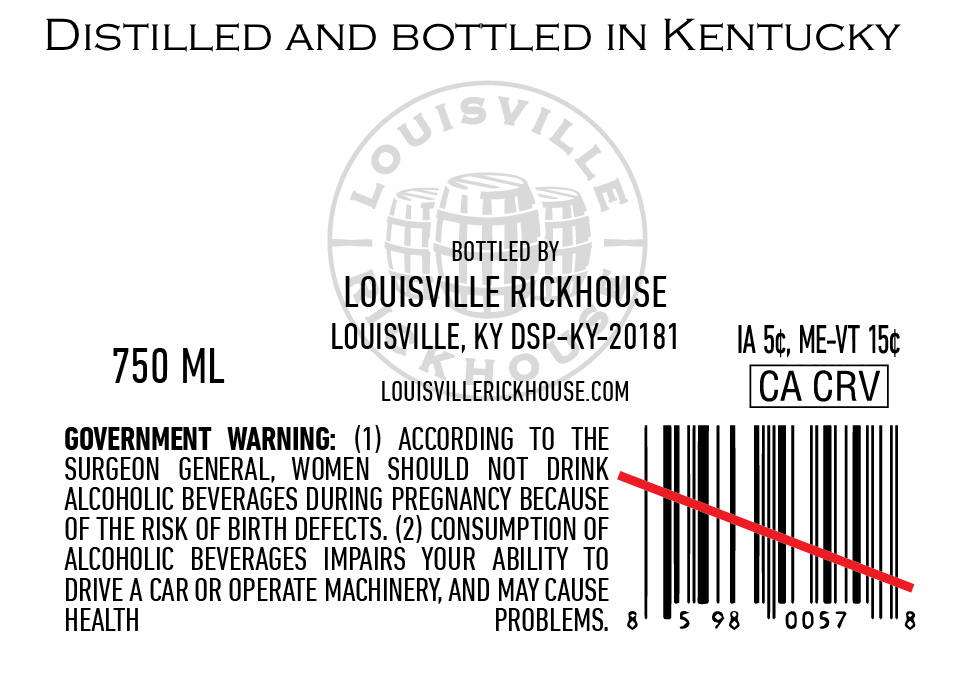
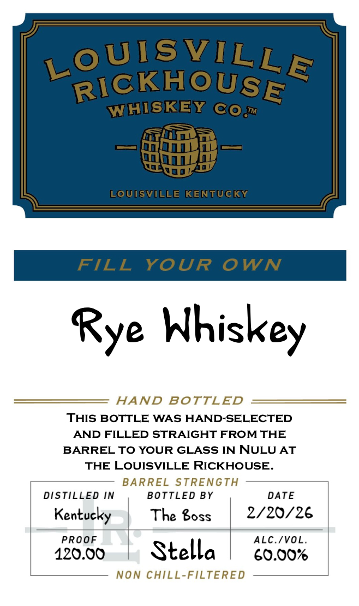

# TTB COLA Label Images - TTBID 26054001000670

**Brand Name:** LOUISVILLE RICKHOUSE WHISKEY CO

**Issue Date:** 02/24/2026

**Origin Code:** 22

**Product Class/Type:** 142

**Source:** [TTB Public COLA Registry](https://ttbonline.gov/colasonline/viewColaDetails.do?action=publicFormDisplay&ttbid=26054001000670)

## Label Images

### Back Label

### Label 1

## Extracted Label Text

*Text extracted via OCR - may contain errors*

### Back Label

DISTILLED AND BOTTLED IN KENTUCKY

BOTTLED BY

LOUISVILLE RICKHOUSE

LOUISVILLE, KY DSP-KY-20181

IA.S¢, ME-VT 15¢

750 ML

LOUISVILLERICKHOUSE.COM

CA CRV

GOVERNMENT WARNING: (1) ACCORDING TO THE

SURGEON GENERAL, WOMEN SHOULD NOT DRINK

ALCOHOLIC BEVERAGES DURING PREGNANCY BECAUSE

OF THE RISK OF BIRTH DEFECTS. (2) CONSUMPTION OF

ALCOHOLIC BEVERAGES IMPAIRS YOUR ABILITY TO

DRIVE A CAR OR OPERATE MACHINERY, AND MAY CAUSE

HE

BLEMS. 8

5 98

0057

8

### Label 1

oUISVILE

SICKHOUSE.

WWE

KEN (‘Co

ire

— minnie ne —

ra

Ey

IWA

Rye Whiskey

—————

es!

ND BOT

LED

=

THIS BOTTLE WAS HAND-SELECTED

AND FILLED STRAIGHT FROM THE

BARREL TO YOUR GLASS IN NULU AT

THE LOUISVILLE RICKHOUSE.

B

2

TRENG

DISTILLED IN

BOTTLED BY

DATE

Kentucky |

The Boss

| 2/20/26

PROOF

|

ALC./VOL.

120.00

|

Stella

60.00%

”

ED
