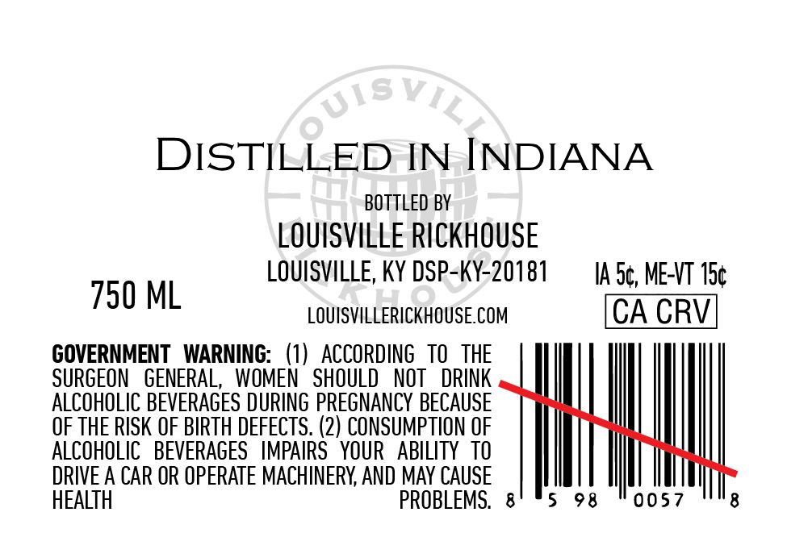
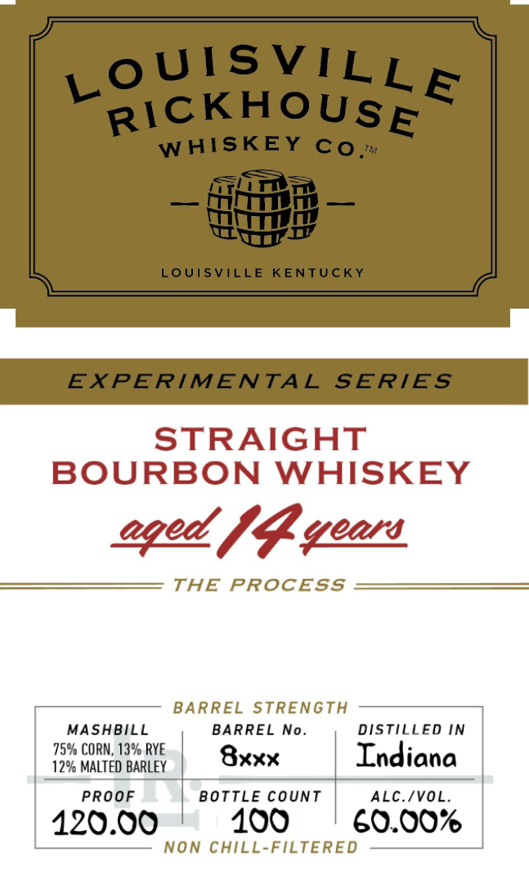

# TTB COLA Label Images - TTBID 26054001000697

**Brand Name:** LOUISVILLE RICKHOUSE WHISKEY CO

**Issue Date:** 02/27/2026

**Origin Code:** 22

**Product Class/Type:** 101

**Source:** [TTB Public COLA Registry](https://ttbonline.gov/colasonline/viewColaDetails.do?action=publicFormDisplay&ttbid=26054001000697)

## Label Images

### Back Label

### Front Label

## Extracted Label Text

*Text extracted via OCR - may contain errors*

**Detected Proof:** 120

### Back Label

DISTILLED IN INDIANA
BOTTLED BY
LOUISVILLE RICKHOUSE
750 ML LOUISVILLE, KY DSP-KY-20181 IA 5¢, ME-VT 15¢
LOUISVILLERICKHOUSE.COM CA CRV
GOVERNMENT WARNING: (1) ACCORDING TO THE
SURGEON GENERAL, WOMEN SHOULD NOT DRINK
ALCOHOLIC BEVERAGES DURING PREGNANCY BECAUSE
OF THE RISK OF BIRTH DEFECTS. (2) CONSUMPTION OF
ALCOHOLIC BEVERAGES IMPAIRS YOUR ABILITY TO
DRIVE A CAR OR OPERATE MACHINERY, AND MAY CAUSE
HEALTH PROBLEMS. 8' °5 98 "0057 8

### Front Label

FEIN GTI

STRAIGHT

BOURBON WHISKEY

oped fp years

THE PROCESS

BARREL STRENGTH

75% CORN, 13% RYE

MASHBILL

BARREL No.

DISTILLED IN

|

12% MALTED BARLEY

Bxxx

Indiana

PROOF

BOTTLE COUNT

ALC./VOL.

120.00

100

60.00%

NON CHILL-FILTERED
