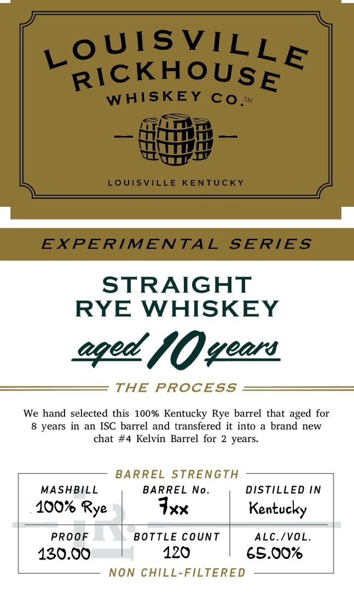

# TTB COLA Label Images - TTBID 26054001000700

**Brand Name:** LOUISVILLE RICKHOUSE WHISKEY CO

**Issue Date:** 02/25/2026

**Origin Code:** 22

**Product Class/Type:** 102

**Source:** [TTB Public COLA Registry](https://ttbonline.gov/colasonline/viewColaDetails.do?action=publicFormDisplay&ttbid=26054001000700)

## Label Images

### Back Label

### Front Label

## Extracted Label Text

*Text extracted via OCR - may contain errors*

**Detected Age:** 8 Years

### Back Label

DISTILLED AND BOTTLED IN KENTUCKY

BOTTLED BY
LOUISVILLE RICKHOUSE
LOUISVILLE, KY DSP-KY-20181

730 ML LOUISVILLERICKHOUSE.COM

GOVERNMENT WARNING: (1) ACCORDING TO THE
SURGEON GENERAL, WOMEN SHOULD NOT DRINK
ALCOHOLIC BEVERAGES DURING PREGNANCY BECAUSE
OF THE RISK OF BIRTH DEFECTS. (2) CONSUMPTION OF
ALCOHOLIC BEVERAGES IMPAIRS YOUR ABILITY TO
DRIVE A CAR OR OPERATE MACHINERY, AND MAY CAUSE
HEALTH PROBLEMS. 8

5

IA.S¢, ME-VT 15¢

98

CA CRV

0057

8

### Front Label

STRAIGHT
RYE WHISKEY

aged, VO wees
THE PROCESS
We hand selected this 100% Kentucky Rye barrel that aged for

8 years in an ISC barrel and transfered it into a brand new
chat #4 Kelvin Barrel for 2 years.

BARREL STRENGTH

MASHBILL BARREL No. DISTILLED IN
100% Rye Ixx | Kentucky
PROOF | BOTTLE COUNT | ALC./VOL.
130.00 120 65.00%
NON CHILL-FILTERED
