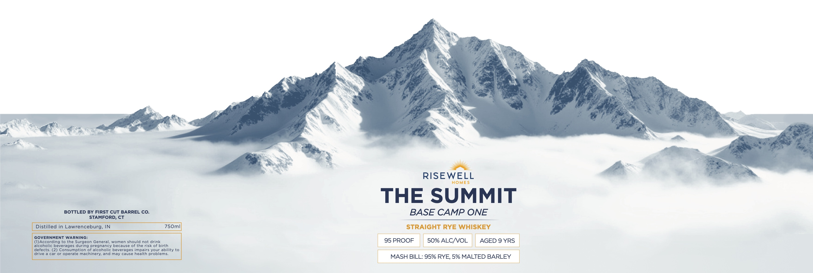

# TTB COLA Label Images - TTBID 26054001000706

**Brand Name:** THE SUMMIT

**Issue Date:** 02/27/2026

**Origin Code:** 14

**Product Class/Type:** 102

**Source:** [TTB Public COLA Registry](https://ttbonline.gov/colasonline/viewColaDetails.do?action=publicFormDisplay&ttbid=26054001000706)

## Label Images

### Label 1

## Extracted Label Text

*Text extracted via OCR - may contain errors*

**Detected Proof:** 100
**Detected Age:** 9 Years

### Label 1

BOTTLED BY FIRST CUT BARREL CO.
STAMFORD, CT

Distilled in Lawrenceburg, IN

GOVERNMENT WARNING:

(1)According to the Surgeon General, women should not drink
alcoholic beverages during pregnancy because of the risk of birth
defects. (2) Consumption of alcoholic beverages impairs your ability to

drive a car or operate machinery, and may cause health problems.

RISEWELL

THE SUMMIT

BASE CAMP ONE

750ml

STRAIGHT RYE WHISKEY

50% ALC/VOL

AGED 9 YRS

MASH BILL: 95% RYE, 5% MALTED BARLEY
