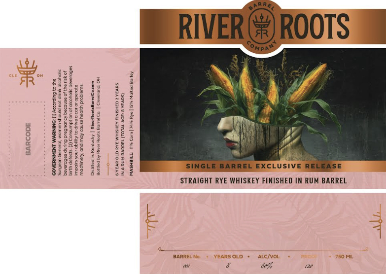

# TTB COLA Label Images - TTBID 26055001000153

**Brand Name:** RIVER ROOTS BARREL COMPANY

**Issue Date:** 02/27/2026

**Origin Code:** 09

**Product Class/Type:** 142

**Source:** [TTB Public COLA Registry](https://ttbonline.gov/colasonline/viewColaDetails.do?action=publicFormDisplay&ttbid=26055001000153)

## Label Images

### Label 1

## Extracted Label Text

*Text extracted via OCR - may contain errors*

### Label 1

eal ae
if KG) k a
Beigeg GE 282 : :
rite Ste:
mB ESatee go) aha “ a
Hae ¥io 323 SINGLE BARREL EXCLUSIVE RELEASE
ain oe STRAIGHT RYE WHISKEY FINISHED IN RUM BARREL
i
4
4 BARRE! SOLD + ALC/V ML
av é a, ne
