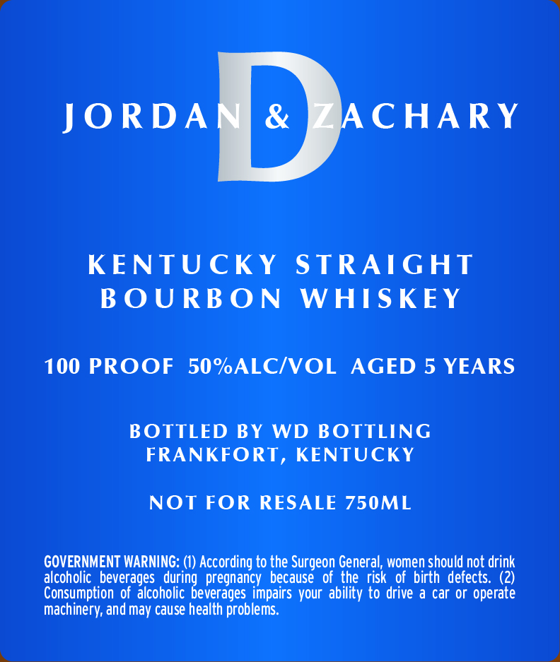
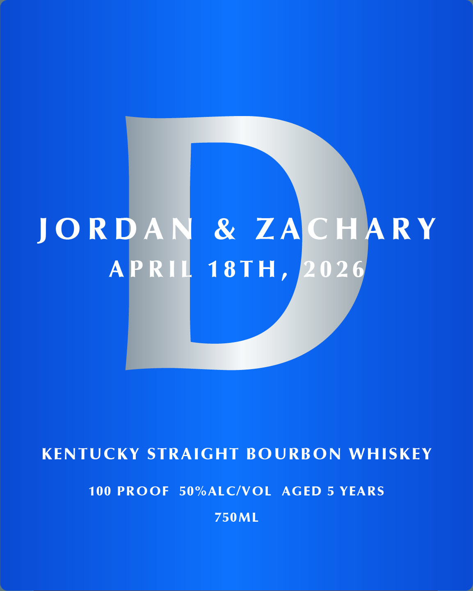

# TTB COLA Label Images - TTBID 26055001000165

**Brand Name:** WD BOTTLING

**Fanciful Name:** JORDAN & ZACHARY

**Issue Date:** 02/25/2026

**Origin Code:** 22

**Product Class/Type:** 101

**Source:** [TTB Public COLA Registry](https://ttbonline.gov/colasonline/viewColaDetails.do?action=publicFormDisplay&ttbid=26055001000165)

## Label Images

### Back Label

### Front Label

## Extracted Label Text

*Text extracted via OCR - may contain errors*

**Detected Proof:** 100
**Detected Age:** 5 Years

### Back Label

ACHARY

JORDA

KENTUCKY STRAIGHT

BOURBON WHISKEY

100 PROOF 50%ALC/VOL AGED 5 YEARS

BOTTLED BY WD BOTTLING

FRANKFORT, KENTUCKY

NOT FOR RESALE 750ML

GOVERNMENT WARNING: (1) According to the Surgeon General, women should not drink

alcoholic beverages durin

pregnancy because of the risk of birth defects. (2)

Consumption of alcoholic

d

everages impairs your ability to drive a car or operate

Machinery, and may cause health problems.

### Front Label

JORE & ZA ARY
A 18TH,
KENTUCKY STRAIGHT BOURBON WHISKEY
100 PROOF 50%ALC/VOL AGED 5 YEARS
750ML
