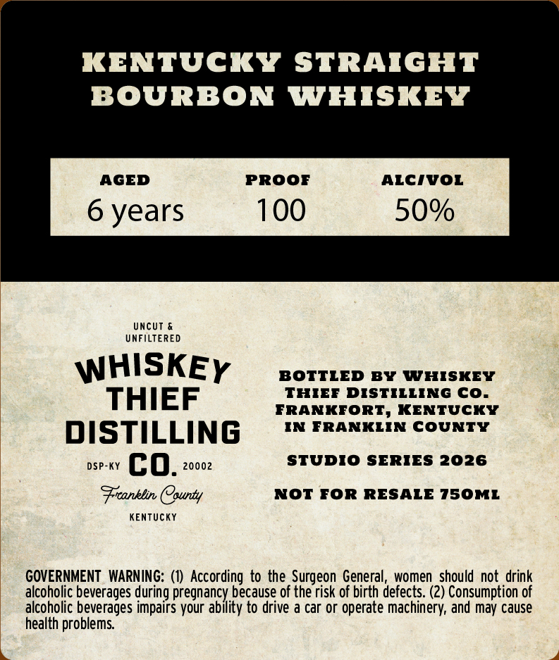
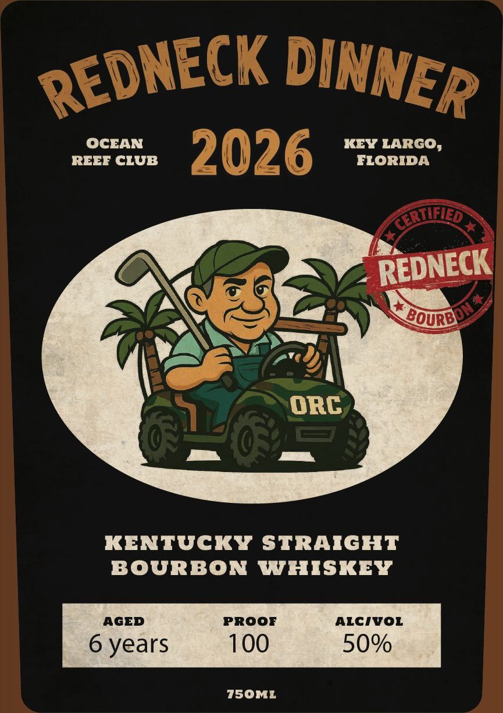

# TTB COLA Label Images - TTBID 26055001000197

**Brand Name:** WHISKEY THIEF DISTILLING CO.

**Fanciful Name:** REDNECK DINNER

**Issue Date:** 02/25/2026

**Origin Code:** 22

**Product Class/Type:** 101

**Source:** [TTB Public COLA Registry](https://ttbonline.gov/colasonline/viewColaDetails.do?action=publicFormDisplay&ttbid=26055001000197)

## Label Images

### Back Label

### Front Label

## Extracted Label Text

*Text extracted via OCR - may contain errors*

**Detected Proof:** 100
**Detected Age:** 6 Years

### Back Label

KENTUCKY STRAIGHT

BOURBON WHISKEY

AGED

PROOF

ALCIVOL

100

50%

6 years

UNCUT &

UNFILTERED

WHISKEy

BOTTLED BY WHISKEY

THIEF DISTILLING CO.

THIEF

FRANKFORT, KENTUCKY

IN FRANKLIN COUNTY

DISTILLING

STUDIO SERIES 2026

DSP-KY C 0. 20002

Franklin County

NOT FOR RESALE 750ML

KENTUCKY

GOVERNMENT WARNING: (1) According to the Surgeon General, women should not drink

alcoholic beverages during pregnancy because of the risk of birth defects. (2) Consumption of

alcoholic beverages impairs your ability to drive a car or operate machinery, and may cause

health problems.

### Front Label

OCEAN

KEY LARGO,

REEF CLUB

FLORIDA

~ REDNECK

\SOURB

BA

Ges

ORC

iz

KENTUCKY STRAIGHT

BOURBON WHISKEY

AGED

PROOF

ALCIVOL

6 years

100

50%

750ML
